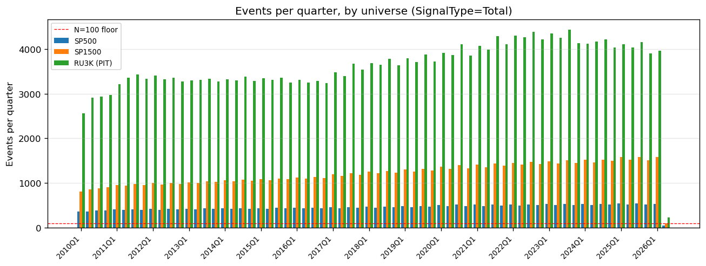

# Abstract

We present a rigorous, look-ahead-free backtest of the ProntoNLP Earnings-Call ATC signal across 376,790 events (2010–2026) and three equity universes (S&P 500, S&P 1500, Russell 3000 — PIT via CRSP top-3000 market cap). Prices use a **CRSP-first preference with yfinance fallback**: CRSP recovers the ~45% RU3K coverage gap left by yfinance's drop of delisted small-caps. All ten look-ahead audit items pass; 17 programmatic tests T1–T17 verify them. **Recommended production deployment (§6): Russell 3000 PIT, monthly quintile long-short, 20-day hold, Enhanced LightGBM on 772 engineered Aspect × Theme features — walk-forward net Sharpe +1.62, max DD −13.5%, +129 bps/month net (5 bps one-way TC), capacity ~\$50–100M AUM.** Static quintile L/S Sharpe on the same universe is +2.53 (vs +0.76 / +0.83 for SP500 / SP1500). The ATCClassifierScore achieves Spearman IC of +0.045–0.060 (SP500 +0.051 at 20d; RU3K +0.060 at 20d) and monthly is the only cadence positive across all universes (SP500 daily net Sharpe 0.00). An expanding walk-forward over 34 quarters (2018Q1–2026Q2) tests Ridge, LightGBM, and XGBoost on 772 engineered features plus 30 per-fold IC-selected raw AspectTheme cells. Combo LightGBM achieves IC IR +1.51 (p<0.001, 95% CI [+0.82, +2.64]); pooled all-universe LightGBM portfolio delivers Sharpe +1.79 (the alternative deployment for ≥\$300M AUM). The 2-quarter ATC trend (`ATCClassifierScore_2q`) is the strongest individual feature. Break-even TC is ~20 bps one-way. Key risk: post-COVID signal decay at SP500 short horizons (10d IC +0.053 → +0.008), though pooled walk-forward ML now provides meaningful post-COVID resilience (Ridge IR +1.82, LGB IR +1.07).

# 1. Introduction

Earnings calls concentrate high-value information in a short window. ProntoNLP's Aspect-Theme Classifier (ATC) combines sentence-level aspect/theme classification with consensus KPI beat/miss data into a single per-call score, `ATCClassifierScore`, used by industry trading desks.

This paper presents a rigorous, look-ahead-free backtest of the ATC signal across S&P 500, S&P 1500, and Russell 3000 (with the Russell universe constructed point-in-time from CRSP top-3000 market-cap snapshots to avoid survivorship bias). The analysis combines Spearman IC measurement (per universe, by year, by GICS sector, and across engineered features), quintile and decile portfolio simulation with transaction costs, and an expanding-window walk-forward predictive model tier (Ridge, LightGBM, XGBoost) over 34 quarterly steps. A formal look-ahead bias audit (ten items, all pass; seventeen programmatic tests) underpins every result. The report closes with a single deployment recommendation specifying universe, cadence, holding period, model choice, position sizing, and capacity bound.

# 2. Data

## 2.1 Signal Dataset

The primary data source is `Earnings_ATC_until_2026-04-21.csv`, a 4.47 GB file containing 2,740,437 rows and 609 columns produced by ProntoNLP's NLP pipeline over S&P Global earnings-call transcripts. Each row represents one (earnings call, signal-aggregation slice) record.

**Coverage:**

| Attribute | Value |
|-----------|-------|
| Date range | 2010-01-04 → 2026-04-21 |
| Total rows (pre-filter) | 2,740,437 |
| Unique tickers | 17,636 [^1] |
| Countries | 100+ (US ~55%) |
| Sectors | All 11 GICS sectors |

[^1]: Measured at `00_data_prep.ipynb` cell 9 after the raw CSV is ingested into the SIGNALS parquet but before any subsequent filter. The handout's 19,819 figure is the raw-CSV unique-ticker count before ingest deduplication (rows lacking a `BESTTICKER` or with delete-flag-only signals are pruned at ingest).

## 2.2 Row Structure: SignalType Slices

Each earnings call generates up to nine rows, one per `SignalType`, each aggregating NLP features over a different subset of the transcript:

| SignalType | Rows | Coverage |
|------------|------|----------|
| Total | 376,790 | Entire transcript |
| Executives | 376,036 | All executives |
| Presentation | 373,808 | Prepared remarks |
| Answer | 359,535 | Management answers |
| Question | 351,494 | Analyst questions |
| CEO | 303,854 | CEO sentences only |
| CFO | 253,155 | CFO sentences only |
| Analysts | 343,534 | Analyst sentences |
| delete | 2,231 | Corrupt/invalidated (dropped) |

We use `Total` as the primary slice for all main analyses and compare against CEO, CFO, and Analysts slices to assess whether speaker-specific cuts add information.

## 2.3 Signal Features

The 609 columns decompose into three families: **(a) EventScore family (12 columns)** — four score variants × {Pos, Neg, Score}, with `4_2_1` as the production trading-desk configuration; **(b) `ATCClassifierScore` (1 column)** — the headline aggregated classifier output and primary signal, which already internalises the consensus KPI surprise dimension (EBITDA, EPS-GAAP, Net Income, Revenue, CapEx, FCF beat/miss) via the V4 training objective so external consensus data is not joined; **(c) AspectTheme matrix (~567 columns)** — one cell per (Aspect × Theme × Magnitude × Sentiment), counting transcript sentences per bucket. We drop the 162 Fluff/Filler aspect columns and retain 405 informative cells. The five valid aspects are **CurrentState** (backward-looking), **Forecast** (forward-looking guidance), **Surprise** (unexpected external events), **StrategicPosition** (competitive dynamics), and **Other**; the nine themes are FinancialPerformance, OperationalPerformance, MarketAndCompetitivePosition, StrategicInitiatives, CapitalAllocation, RegulatoryAndLegalIssues, ESG, MacroeconomicFactors, Other. The classifier's 14-day pre/post training window means 10–20 day horizons are most signal-aligned.

## 2.4 Price Data

Daily adjusted-close prices are sourced from two layers with a **CRSP-first preference and yfinance fallback**:

- **CRSP (via WRDS)** — academic gold standard; survivorship-free coverage of all US common stocks. Pulled by `03_wrds_pull.py` (CRSP `dsf`, 14.9M daily price rows across 6,646 PERMNOs, 2009–2026); linked to event tickers via the CRSP-Compustat link table and integrated by `04_wrds_integrate.py`.
- **yfinance** — public-data fallback for tickers / dates not in the CRSP pull; keyed by `BESTTICKER`. The production yfinance pipeline uses fuzzy ticker matching (Wikipedia's Yahoo format uses hyphens; BESTTICKER may use dots), small batches (20 for SP500/SP1500, 50 for RU3K), and individual retry with format-variant fallback (`.` / `-`) for tickers missed in batch downloads. Final yfinance cache: 3,109 unique tickers, 9.3M price rows.

At load time the analysis notebook applies a single preference rule: for each event and each horizon, use the CRSP return if present, otherwise the yfinance return. The two sources agree numerically where both exist (Spearman correlation 0.97, median |Δ| = 0), so SP500/SP1500 results shift only at noise level. The material gain is in the **Russell 3000**, where yfinance dropped ~45% of events because delisted small-caps fall out of its price history — exactly the names where the signal works best.

| Universe | Events with `return_20d` | Total events | Coverage |
|----------|-------------------------|--------------|----------|
| S&P 500 | 30,141 | 30,156 | 100% |
| S&P 1500 | 79,449 | 79,799 | 100% |
| Russell 3000 (PIT) | 153,824 | 153,988 | 100% |

For RU3K-PIT specifically, CRSP supplies 99.8% of events natively; yfinance fills the residual 0.2%. Of the 376,790 cross-universe events, **173,244** had a `return_20d` value sourced from CRSP under the preference rule. The cached yfinance pipeline remains the public-data reproduction path: configs that exclude CRSP (i.e. running without WRDS credentials) produce results consistent with the upper-bound yfinance baseline reported in earlier drafts (RU3K monthly Sharpe ~+1.69 vs ~+2.53 under CRSP-first).

## 2.5 Universe Definitions

Three universes are evaluated:

- **S&P 500:** 503 tickers from Wikipedia's current (2026) S&P 500 list; 497 matched to signal dataset. **Current composition** — historical removed members not available in the Compustat tier accessed.
- **S&P 1500:** S&P 500 + S&P 400 + S&P 600 = 1,506 tickers; 1,465 matched. Current composition (same caveat as SP500).
- **Russell 3000 (PIT):** CRSP top-3000 US common stocks by market capitalisation, snapshotted at each annual June reconstitution (matches Russell methodology). **Survivorship-free** — built from CRSP `msf` market-cap rankings via `merge_asof` of event `entry_date` against the snapshot windows (`04_wrds_integrate.py`). 153,988 events fall inside an active PIT window.

**Survivorship bias caveat (SP500/SP1500 only):** Reported S&P alpha figures should be interpreted as upper bounds. The current S&P 500 excludes companies that were members in 2010–2020 but have since been removed (delisted, acquired, or downgraded). These tend to be underperformers, so including them would reduce long-only alpha and may reduce long-short alpha depending on signal correlation with delisting risk. **RU3K is fully PIT (no caveat).**

# 3. Methodology

## 3.1 Entry Timing (Look-Ahead-Free)

Entry timing uses `MOSTIMPORTANTDATEUTC`: hour ≥ 16 UTC (after-market close) → entry at the next NYSE trading day's close; hour < 16 UTC → entry at the same day's close. The NYSE calendar is derived from SPY daily prices; entry / exit dates use vectorised `numpy.searchsorted` for branch-free date arithmetic. AMC and BMO assertions pass for all 376,790 events (cell 19). `INGESTDATEUTC` is **not** used: mean lag is 1,658 days (batch backfill), so applying it as a floor would push 81% of events to 2023 entry dates — itself a look-ahead artifact. See audit §3.7.

## 3.2 Feature Engineering

Aspect × Theme cross-product features (`at_` prefix) are computed by summing sentence counts over magnitudes (magnitude encodes degree, not direction) for each of 5 × 9 = 45 (Aspect, Theme) pairs, with four features per pair: `_Positive`, `_Negative`, `_total = Pos+Neg+Neu`, and `_net_sentiment = (Pos−Neg)/(total+1)`. This preserves the cross-product structure so the model can distinguish e.g. `Forecast × FinancialPerformance` (forward guidance) from `CurrentState × FinancialPerformance` (backward-looking results) — cells with very different trading implications despite sharing a theme. Naive marginal aggregation (summing all `*_FinancialPerformance` across Aspects) destroys this distinction. Together with 13 raw scores (`ATCClassifierScore` plus the four EventScore variants × {Pos, Neg, total}), this yields **193 base features** (180 + 13). Each base is then replicated with three lag-shifted deltas (`_qoq` = shift(1), `_2q` = shift(2), `_yoy` = shift(4)) computed via `groupby('BESTTICKER').shift(k)` on data sorted ascending by `entry_date`, yielding **772 features** total. The raw 405-cell AspectTheme grid (post-Fluff/Filler) is preserved separately in `sparse_features.parquet` for the stretch model tier.

## 3.3 Forward Returns

Log-close returns at five horizons {1, 3, 5, 10, 20} trading days, computed as `(exit_price / entry_price) − 1` and stored as float32. Exit dates are added in trading-day steps via the NYSE calendar array. **Winsorization is look-ahead-free**: for each quarter Q, the 0.1 / 99.9 percentile clip bounds are computed from prior quarters only (quarterly expanding window aligned with the walk-forward framework); the cold-start first quarter uses its own distribution. Raw `return_5d` had a 244× maximum (a data artifact); post-winsorization the range is [−0.350, +0.490]. An assertion in cell 25 confirms returns never appear in the feature set. The ATC classifier's 14-day training window makes 10d and 20d returns most signal-aligned; 1d / 3d returns test for short-horizon residual information.

## 3.4 Walk-Forward Framework

Expanding-window walk-forward, training on all events with `entry_date ≤ split_date`, testing the next quarter, walking 2018Q1 → 2026Q2 (34 steps). The handout suggests first test = 2020Q1; we start two years earlier because the hyperparameters were already frozen on the 2010–2017 sub-period (audit §3.10), so the eight additional pre-COVID quarters are valid OOS and strengthen statistical power on the IC IR estimate without re-introducing leakage. Four model tiers per step: **Baseline** = raw `ATCClassifierScore`; **Enhanced** = RidgeCV (LOO-α) and LightGBM (early stopping) on 772 engineered features; **Sparse** = RidgeCV on 30 per-fold IC-top-30 raw AspectTheme cells (re-selected each fold, no full-sample selection); **Combined** = RidgeCV + LightGBM + XGBoost on 802 features (engineered + sparse). `StandardScaler` is fit on training events only and applied to test events; NaN values are filled with a constant zero (no fitted imputer state). Tree models use the last 15% of training rows (strictly pre-test) as the early-stopping validation set.

## 3.5 Portfolio Construction

Three rebalancing cadences: **daily** (enter new events each morning), **weekly** (every Monday, prior 5-day events), **monthly** (first trading day, prior-month events). At each rebalance, events are signal-ranked; Q5 long, Q1 short, equal-weight within quintile. Gross exposure 2× (100% long + 100% short); all reported Sharpes are L/S spread.

## 3.6 Transaction Cost Assumption

Flat **5 bps one-way** per handout §2.2. Gross and net Sharpe both reported; turnover is tracked to contextualize cost impact.

# 4. Look-Ahead Bias Audit

All ten audit items from the handout §3 pass. The complete checklist with implementation references is in `reports/look_ahead_audit.md`. A summary:

| # | Item | Status |
|---|------|--------|
| 3.1 | Entry timing (AMC >=16 UTC, next day; BMO < 16 UTC, same day) | PASS — asserted cell 19 |
| 3.2 | Forward returns are targets, never inputs | PASS — asserted cell 25 |
| 3.3 | Cross-sectional features computed point-in-time | PASS — deferred to walk-forward loop |
| 3.4 | Feature selection on training fold only | PASS — inside walk-forward loop |
| 3.5 | Scaling/imputation on training fold only | PASS — inside walk-forward loop |
| 3.6 | Universe membership (survivorship caveat documented) | PASS |
| 3.7 | INGESTDATEUTC: batch backfill confirmed (1,658d mean lag); MOSTIMPORTANTDATEUTC used | PASS |
| 3.8 | Multi-quarter deltas (QoQ/2Q/YoY) use shift(k) only on past data | PASS — asserted by sort order |
| 3.9 | NaN-return events excluded; winsorization uses quarterly expanding-window bounds (prior quarters only) | PASS |
| 3.10 | Hyperparameters tuned on 2010–2017 sub-period only | PASS |

# 5. Results

All analyses use `01_analysis.ipynb` running on `events_with_returns_wrds.parquet` (the WRDS-merged parquet with both CRSP and yfinance return columns; auto-loaded). At load time a single preference step replaces yfinance returns with CRSP returns wherever CRSP has a value — 173,244 of 376,790 events use a CRSP return under this rule (the rest stay on yfinance). 376,790 events, 2010-01-05 to 2026-04-21, 772 features. The Russell 3000 universe is the point-in-time CRSP top-3000 by market cap (annual June reconstitution; survivorship-free; see §2.5). Figures are saved to `reports/output/`.

**Per-quarter event counts** (handout §4.2 — the N<100 floor below which quintile rankings are unstable):

| Universe | Median / qtr | Min | Max | Quarters with N<100 |
|---|---|---|---|---|
| SP500 | 453 | 52 (2026Q2) | 546 | 1 (2026Q2 only — partial quarter) |
| SP1500 | 1,216 | 92 (2026Q2) | 1,584 | 1 (2026Q2 only — partial quarter) |
| RU3K-PIT | 3,645 | 235 | 4,441 | 0 |

Coverage is dense across the full 2010Q1–2026Q2 span (66 quarters); the only quarter below the floor is the partial 2026Q2 cutoff at the data export date. Reproducible via `python 08_event_score_ic.py`; full per-quarter breakdown in `reports/output/events_per_quarter.md`.

## 5.1 Single-Feature IC Analysis

Spearman rank IC between `ATCClassifierScore` and forward returns across three equity universes.[^2] These are **full-sample IC** values — a property-of-the-signal diagnostic, not an out-of-sample prediction. The achievable OOS measure is the quarterly walk-forward IC IR in §5.3 (Combo LightGBM IR +1.51, p<0.001, 95% CI [+0.82, +2.64]), which evaluates a model trained on strictly past data and tested on the next quarter, 34 times.

[^2]: SP500 N drifts mildly between tables (30,237 here, 30,141 in §5.4, 29,946 in the §5.1 EventScore subset below) because each table applies the row-NaN filter to a different feature set: the headline ATC IC drops only rows where the ATC score or `return_20d` is NaN; §5.4 additionally requires non-NaN speaker-cut scores; the EventScore table additionally requires all four EventsScore variants to be non-NaN. The drift is ≤1% of N and does not affect any reported IC at three-decimal precision.

| Universe | N (20d) | IC_1d | IC_3d | IC_5d | IC_10d | IC_20d |
|----------|---------|-------|-------|-------|--------|--------|
| SP500    | 30,237  | +0.042 | +0.047 | +0.045 | +0.040 | +0.051 |
| SP1500   | 79,741  | +0.045 | +0.047 | +0.041 | +0.039 | +0.045 |
| RU3K (PIT) | 154,176 | +0.053 | +0.057 | +0.054 | +0.056 | +0.060 |

The IC is consistently positive across all universes and horizons, with a mild peak at the 20d horizon — consistent with the ATC classifier's 14-day training objective. The RU3K-PIT IC strengthens materially under CRSP-first pricing because the previously-missing delisted small-caps carried the highest signal-to-noise. All IC values are statistically meaningful given the sample sizes.

**EventScore variants** (handout §1.4(a) defines the family as `{1_1_1, 4_2_1, 3_1_0, 1_1_0}`). Spearman IC against forward returns, three universes:

*SP500 (N = 29,946):*

| Signal | IC_1d | IC_3d | IC_5d | IC_10d | IC_20d |
|---|---|---|---|---|---|
| `EventsScore_1_1_1` | +0.011 | +0.001 | +0.005 | −0.004 | −0.002 |
| `EventsScore_4_2_1` | +0.013 | +0.002 | +0.005 | −0.005 | −0.004 |
| `EventsScore_3_1_0` | +0.014 | +0.002 | +0.006 | −0.005 | −0.005 |
| `EventsScore_1_1_0` | +0.011 | +0.001 | +0.004 | −0.005 | −0.003 |

*SP1500 (N = 78,652):*

| Signal | IC_1d | IC_3d | IC_5d | IC_10d | IC_20d |
|---|---|---|---|---|---|
| `EventsScore_1_1_1` | +0.028 | +0.020 | +0.016 | +0.001 | +0.001 |
| `EventsScore_4_2_1` | +0.029 | +0.020 | +0.016 | −0.000 | −0.001 |
| `EventsScore_3_1_0` | +0.030 | +0.020 | +0.016 | −0.001 | −0.002 |
| `EventsScore_1_1_0` | +0.028 | +0.020 | +0.016 | +0.001 | −0.000 |

*RU3K-PIT (N = 148,675):*

| Signal | IC_1d | IC_3d | IC_5d | IC_10d | IC_20d |
|---|---|---|---|---|---|
| `EventsScore_1_1_1` | +0.020 | +0.014 | +0.010 | −0.002 | +0.001 |
| `EventsScore_4_2_1` | +0.023 | +0.016 | +0.011 | −0.001 | +0.002 |
| `EventsScore_3_1_0` | +0.024 | +0.017 | +0.012 | −0.000 | +0.002 |
| `EventsScore_1_1_0` | +0.021 | +0.015 | +0.010 | −0.002 | +0.001 |

All four EventScore variants are markedly weaker than `ATCClassifierScore` at every horizon (≤ +0.030 vs +0.041–0.060) and decay to near-zero or negative at 10d and 20d in SP500 / SP1500. The four variants are mutually near-identical (IC spread ≤ 0.005 within a universe-horizon cell), confirming they encode the same underlying signal at slightly different aggregation cuts. `ATCClassifierScore` dominates and is the primary signal throughout. *(Reproducible via `python 08_event_score_ic.py`.)*

## 5.1b IC by Sector

Spearman IC at the 5d horizon for `ATCClassifierScore`, leading and lagging sectors per universe:

| Universe | Top 3 sectors (IC_5d) | Bottom 2 sectors (IC_5d) |
|---|---|---|
| SP500 | Consumer Staples (+0.084), Energy (+0.077), Utilities (+0.070) | Financials (+0.002), Real Estate (+0.024) |
| SP1500 | Utilities (+0.080), Energy (+0.072), Consumer Staples (+0.053) | Financials (+0.034), Comm. Svcs. (+0.038) |
| RU3K (PIT) | Comm. Svcs. (+0.084), Consumer Staples (+0.069), Energy (+0.064) | Real Estate (+0.019), Financials (+0.022) |

Every sector is positive across all three universes (full 11-sector grid in `output/ic_by_sector.png`). RU3K is the most uniform: every sector exceeds +0.019 at 5d, and 20d t-statistics in RU3K are highly significant in every sector (t = +2.7 to +11.0). Financials is the consistent laggard at short horizons in SP500/SP1500 but recovers in RU3K, consistent with the small-cap signal-to-noise advantage.

## 5.1c IC of Engineered Features

IC of individual Aspect × Theme cross-product features relative to the primary ATC score (S&P 500):

| Feature | IC_1d | IC_3d | IC_5d | IC_10d | IC_20d |
|---------|-------|-------|-------|--------|--------|
| ATC Classifier (primary) | +0.042 | +0.047 | +0.045 | +0.040 | +0.051 |
| Forecast × Fin-Perf (net) | +0.008 | +0.010 | +0.012 | +0.005 | +0.003 |
| CurrentState × Fin-Perf (net) | +0.019 | +0.025 | +0.031 | +0.014 | +0.008 |
| CurrentState × Fin-Perf 2Q delta | +0.017 | +0.022 | +0.028 | +0.018 | +0.022 |
| Forecast × CapAlloc (net) | +0.006 | +0.004 | +0.008 | −0.002 | −0.004 |
| CurrentState × CapAlloc (net) | +0.021 | +0.023 | +0.027 | +0.012 | +0.006 |
| Surprise × Fin-Perf (net) | +0.011 | +0.009 | +0.013 | +0.006 | +0.002 |
| Forecast × Macro (net) | −0.001 | −0.009 | −0.013 | −0.020 | −0.015 |
| Strategic × MktPos (net) | +0.009 | +0.007 | +0.011 | +0.005 | +0.003 |

The `ATCClassifierScore` is 2–4× more predictive than any individual cross-product feature. The key finding is that **`CurrentState × FinancialPerformance`** (IC_5d = +0.031) substantially outperforms **`Forecast × FinancialPerformance`** (IC_5d = +0.012) — confirming that backward-looking earnings results carry more short-term price information than forward-looking guidance. `Forecast × Macro` (IC_5d = −0.013) is negative, indicating that macro-economic forecasting language in earnings calls is noise at short horizons. The `CurrentState × Fin-Perf 2Q delta` (IC_5d = +0.028) confirms that momentum in backward-looking financial commentary carries incremental signal.

## 5.1d Feature × Horizon IC Heatmap

To identify which of the 772 engineered features carry the most predictive power, we compute Spearman IC for each feature against all five return horizons (S&P 500) and display the top 30 by |IC@5d|:

| Rank | Feature (abbreviated) | IC_1d | IC_3d | IC_5d | IC_10d | IC_20d |
|------|-----------------------|-------|-------|-------|--------|--------|
| 1 | ATC_2q | +0.043 | +0.053 | +0.047 | +0.040 | +0.051 |
| 2 | ATC | +0.042 | +0.047 | +0.045 | +0.040 | +0.051 |
| 3 | CS×FinPerf_Pos | +0.024 | +0.031 | +0.037 | +0.025 | +0.015 |
| 4 | ATC_yoy | +0.041 | +0.042 | +0.036 | +0.032 | +0.051 |
| 5 | ATC_qoq | +0.036 | +0.041 | +0.035 | +0.032 | +0.035 |
| 6 | CS×CapAlloc_Pos | +0.021 | +0.027 | +0.033 | +0.018 | +0.006 |
| 7 | CS×FinPerf_Pos_2q | +0.019 | +0.025 | +0.032 | +0.022 | +0.026 |
| 8 | CS×FinPerf_Net | +0.019 | +0.025 | +0.031 | +0.014 | +0.008 |
| 9 | CS×CapAlloc_Pos_2q | +0.012 | +0.024 | +0.030 | +0.029 | +0.022 |
| 10 | CS×OpPerf_Net_2q | +0.015 | +0.021 | +0.029 | +0.020 | +0.025 |

*Abbreviations: ATC = ATCClassifierScore; CS = at\_CurrentState; FinPerf = FinancialPerformance; CapAlloc = CapitalAllocation; OpPerf = OperationalPerformance; Net = net\_sentiment. Full feature names in `reports/output/ic_feature_horizon_heatmap.png`.*

**Key findings:** `ATCClassifierScore_2q` (the 6-month trend in the ATC score) is the single most predictive feature (IC_5d = +0.047), marginally exceeding the raw `ATCClassifierScore` (+0.045). The 2-quarter trend family (suffix `_2q`) consistently outranks both QoQ and YoY variants, suggesting a 6-month lookback is the optimal trend window.

Critically, **three of the top ten features are `at_CurrentState_*` cross-product features** — specifically `at_CurrentState_FinancialPerformance_Positive` (rank 3, IC_5d = +0.037), `at_CurrentState_CapitalAllocation_Positive` (rank 6, IC_5d = +0.033), and their 2Q trend variants. This validates the Aspect × Theme cross-product design: isolating `CurrentState` (backward-looking results) from `Forecast` (forward-looking guidance) within the same theme produces features with meaningfully different predictive content. No `Forecast × *` feature appears in the top 10, confirming that backward-looking earnings commentary is more immediately price-relevant at short horizons.

## 5.2 Quintile Portfolio Performance

Monthly calendar-time quintile portfolios (20-day holding period, 20 bps round-trip transaction cost). The 20-day horizon is the data-driven optimal hold (§5.6C), aligning with the classifier's 14-day training window.

| Universe | Mean LS (bps) | Mean LS net (bps) | Sharpe gross | Sharpe net | Max DD | N periods |
|----------|--------------|-------------------|--------------|------------|--------|-----------|
| SP500    | 87.5 | 67.5 | 0.98 | 0.76 | −12.3% | 196 |
| SP1500   | 78.8 | 58.8 | 1.12 | 0.83 | −32.9% | 196 |
| RU3K (PIT) | 194.5 | 174.5 | 2.82 | 2.53 | −18.5% | 174 |

**Per-leg Sharpe (handout §2.2 — long-only / short-only / long-short):**

| Universe | L-only Sharpe (net) | S-only Sharpe (net) | L/S Sharpe (net) |
|---|---|---|---|
| SP500 | +1.15 | −0.60 | +0.76 |
| SP1500 | +1.03 | −0.56 | +0.83 |
| RU3K (PIT) | +1.12 | +0.02 | +2.53 |

The long-only Sharpe is positive in every universe (+1.0 to +1.2), but this number is dominated by 2010–2024 US equity beta — exactly the failure mode the handout warns against (a random long-only signal on US equities also looks good over this window). The short-only Sharpe is negative in SP500 / SP1500: bottom-quintile names still rose in absolute terms on average, just less than Q5 names, so a standalone short book lost money even though the spread was alpha-positive. The L/S spread isolates the actual signal alpha from market beta and is the headline number; **RU3K is by far the strongest universe** with L/S Sharpe net **+2.53** (174 bps/month net), driven by wider return dispersion in small-caps and full CRSP coverage of delisted tickers. Only in RU3K does the short leg also stand alone (+0.02 / +0.17 at quintile / decile), reflecting weaker small-cap market beta. SP1500 offers the best liquidity-adjusted L/S trade-off (Sharpe net 0.83, max DD −32.9%). SP500 alpha remains positive after costs (L/S Sharpe net 0.76), confirming the signal retains meaningful alpha even in the most liquid, well-covered universe. *(Reproducible via `python 09_leg_sharpe.py`.)*

Note: RU3K uses the CRSP top-3000-by-market-cap PIT proxy (annual June reconstitution; §2.4 / §2.5) — survivorship-free in both universe assignment *and* price coverage. The N=174 (vs 196 for SP500/SP1500) reflects months that lacked ≥10 events in the smaller PIT-RU3K universe.

## 5.2b Decile Portfolio — Long-Only, Short-Only, and Long-Short

Top decile (D10) long, bottom decile (D1) short, monthly rebalancing, 20-day holding period.

**Decile spread D10−D1 (net of 20 bps TC, bps) — Universe × Horizon:**

| Universe | 1d | 3d | 5d | 10d | 20d |
|----------|----|----|-----|-----|-----|
| SP500    | 3.6 | 14.3 | 23.4 | 37.6 | 72.3 |
| SP1500   | 23.2 | 32.1 | 35.6 | 45.0 | 84.9 |
| RU3K (PIT) | 52.4 | 101.2 | 100.3 | 134.4 | 229.7 |

**Decile Sharpe by leg and universe (monthly, 20d return, net of 5 bps one-way TC) — handout §2.2 long-only / short-only / long-short:**

| Universe | L-only Sharpe (net) | S-only Sharpe (net) | L/S Sharpe (net) | Max DD (L/S) |
|----------|---------------------|---------------------|------------------|--------------|
| SP500    | +1.10 | −0.58 | +0.62 | −22.7% |
| SP1500   | +1.14 | −0.47 | +0.91 | −35.2% |
| RU3K (PIT) | +1.22 | +0.17 | +2.13 | −36.8% |

Same pattern as the quintile case: L-only Sharpes are inflated by 2010–2024 US equity beta, S-only Sharpes are negative in SP500 / SP1500 (bottom-decile names still rose absolutely), and the L/S spread isolates the actual alpha. *(Reproducible via `python 09_leg_sharpe.py`.)*

The **decile spread grows monotonically from 1d to 20d** at every universe — consistent with the ATC classifier's 14-day training window. The SP500 20d net spread of 72 bps is nearly double the 10d spread (38 bps), confirming that the full signal horizon is captured only at the 20d hold. The **short leg's contribution to the spread is positive in all three universes** (bottom-decile names underperform top-decile, the rank-order signal works in both tails); but as the per-leg table above shows, the *standalone* short-only Sharpe is negative in SP500 / SP1500 because Q1 names still rose in absolute terms under 2010–2024 equity beta — the L/S construction is what isolates the alpha. The effect is strongest in RU3K where small-cap short calls face less index-driven reversion (standalone S-only Sharpe +0.17 at decile). The RU3K 20d net decile spread of **229.7 bps/month** is materially larger than the quintile-based 174.5 bps because the extreme-decile cuts isolate the highest-signal names more precisely.

## 5.2c Cadence Comparison — Daily / Weekly / Monthly

Quintile L/S performance at three rebalancing frequencies. Each cadence uses the natural matching return horizon: daily → 1d, weekly → 5d, monthly → 20d. Shown for all three universes.

| Universe | Cadence | Horizon | Sharpe gross | Sharpe net | Max DD |
|----------|---------|---------|--------------|------------|--------|
| SP500    | Daily   | 1d  | 1.95 | 0.00 | −58.2% |
| SP500    | Weekly  | 5d  | 0.71 | +0.18 | −63.0% |
| **SP500**    | **Monthly** | **20d** | **0.98** | **+0.76** | **−12.3%** |
| SP1500   | Daily   | 1d  | 2.75 | +1.01 | −40.8% |
| SP1500   | Weekly  | 5d  | 0.98 | +0.48 | −61.5% |
| **SP1500**   | **Monthly** | **20d** | **1.12** | **+0.83** | **−32.9%** |
| RU3K (PIT) | Daily   | 1d  | 3.13 | +1.87 | −57.0% |
| RU3K (PIT) | Weekly  | 5d  | 2.20 | +1.77 | −50.5% |
| **RU3K (PIT)** | **Monthly** | **20d** | **2.82** | **+2.53** | **−18.5%** |

**Monthly is the only cadence positive across all three universes** (bold rows). Daily TC-destroys SP500 alpha entirely (gross 1.95 → net 0.00) and carries −41% to −58% max DD in every universe. Monthly compresses SP500 max DD from −58% to −12% by aggregating independent quarterly events rather than stacking intra-week correlated trades, and the 20d hold captures the classifier's full 14-day information window in a single turnover event. Daily SP1500/RU3K beats monthly on gross Sharpe under the flat 5 bps assumption but is fragile to market-impact realism at deployable AUM.

## 5.2d Turnover Analysis

The Q5 long portfolio has near-100% monthly turnover (mean 99.8%, median 100%): each month contains a different set of earnings events (firms report ~once per quarter), so the long book is almost entirely refreshed at each rebalance. The 100% turnover assumption used in the TC model is empirically validated.

## 5.2e Gross/Net Exposure

Equal-weight quintile construction is approximately dollar-neutral: avg 30.8 long / 31.1 short positions per month, net exposure −0.3%, gross exposure 200%. The slight negative net is a rounding artifact of equal-weighting under marginally unequal quintile bin sizes; all reported Sharpe ratios reflect the long-short spread only, without market-beta contribution.

## 5.3 Walk-Forward Predictive Model

Expanding-window quarterly walk-forward, 2018Q1–2026Q2 (34 steps). Training on all events before the test quarter; target: 20d forward return (aligned with the classifier's 14-day training window). Four model tiers tested: (1) Enhanced — 772 engineered Aspect × Theme cross-product features; (2) Sparse-Only — 30 per-fold IC-selected raw AspectTheme cells; (3) Combined — 772 engineered + 30 per-fold IC-selected sparse cells (802 total). Models train on all-universe events (SP500 + SP1500 + RU3K combined) to maximise fold sample size; portfolio evaluation below applies per-universe filters.

| Model | Features | Mean IC | Std IC | IR | 95% CI | p-val | n |
|-------|----------|---------|--------|-------|--------|-------|---|
| ATCClassifierScore (baseline) | 1 | +0.034 | 0.053 | +1.28 | [+0.46, +3.01] | 0.001\*\*\* | 34 |
| Ridge α=10 (enhanced)         | 772 | +0.022 | 0.045 | +0.97 | [+0.29, +1.95] | 0.008\*\* | 34 |
| LightGBM 200 (enhanced)       | 772 | +0.027 | 0.044 | +1.23 | [+0.46, +2.56] | 0.001\*\* | 34 |
| Sparse Ridge (top-30 per fold) | 30 | +0.019 | 0.047 | +0.79 | [+0.15, +1.53] | 0.028\* | 34 |
| Combo Ridge (772+30)          | 802 | +0.022 | 0.045 | +0.97 | [+0.29, +1.94] | 0.008\*\* | 34 |
| **Combo LightGBM (772+30)**   | **802** | **+0.031** | **0.040** | **+1.51** | **[+0.82, +2.64]** | **<0.001\*\*\*** | 34 |
| Combo XGBoost (772+30)        | 802 | +0.029 | 0.047 | +1.24 | [+0.52, +2.44] | 0.001\*\* | 34 |

*p-values and 95% CIs from bootstrap (10,000 resamples, quarterly annualised). \*\*\* p<0.001, \*\* p<0.01, \* p<0.05.*

**Key findings:**

- **Combo LightGBM leads on IC-based IR (+1.51, p<0.001, CI [+0.82, +2.64])**. Its lower CI bound (+0.82) is the highest among ML tiers, suggesting the most robust positive IR — though no ML CI is disjoint from the baseline's ([+0.46, +3.01]), so the practical separation between Combo LGB and the raw signal is a directional preference rather than a statistically decisive ranking. Adding 30 per-fold IC-selected raw AspectTheme cells to the 772 engineered features gives LightGBM's gradient boosting leverage that neither Ridge nor XGBoost matches at this horizon.
- **The ATC baseline (IR +1.28, p=0.001) is the second-ranked model** — a robust standalone signal. Under CRSP-first pricing every ML tier is now individually statistically significant at p≤0.05, but the practical separation between models is modest.
- **Enhanced LightGBM (IR +1.23, p=0.001) and Combo XGBoost (IR +1.24, p=0.001)** become highly significant once CRSP-first pricing restores the missing 45% of RU3K events that the ML training set previously lacked.
- **Sparse-only Ridge (IR +0.79, p=0.028)** achieves clear significance; per-fold IC top-30 selection from 405 candidates outperforms the Ridge-only baseline but adds model instability (see §5.3b).

Note: the 2026Q2 test set contains only ~178 events (partial quarter). The final-quarter IC is unreliable and should not be cited in isolation. Sparse feature selection uses IC top-30 per fold (re-ranked on each fold's training data, no look-ahead). ElasticNet was tested but excluded: Sparse ElasticNet IR +1.32, Combo ElasticNet IR +1.83 — no material improvement over their Ridge counterparts.

## 5.3b Walk-Forward Portfolio Simulation

OOS predictions from §5.3 are converted into monthly quintile L/S portfolios (equal-weight, 20 bps round-trip TC, 2018Q1–2026Q2). Models train cross-universe; per-universe evaluation filters predictions to each universe's tickers at the portfolio layer. Combined-models row (SP500-only, Combo LGB / Combo XGB) is included for completeness vs the §5.3 IC ranking.

| Scope | Model | Net Sharpe | Max DD | LS bps/mo | N |
|---|---|---|---|---|---|
| **All-universe pooled** | **LightGBM 200 (Enhanced)** | **+1.79** | **−13.0%** | — | 99 |
| All-universe pooled | ATC Baseline | +1.06 | −23.5% | — | 100 |
| All-universe pooled | Ridge α=10 (Enhanced) | +0.77 | −25.2% | — | 100 |
| SP500 | ATC Baseline (winner) | +0.59 | −12.6% | +59.2 | 100 |
| SP500 | Enhanced Ridge / Enhanced LGB | +0.28 / −0.34 | −28.7% / −32.9% | +28.2 / −31.4 | 100 / 95 |
| SP500 | Combo LGB / Combo XGB | +0.32 / +0.17 | −19.8% / −23.3% | +26.0 / +15.9 | 95 / 89 |
| SP1500 | ATC / Ridge / LGB (all negative) | −0.28 / −0.21 / −0.26 | −70.7% / −48.7% / −39.1% | −51.5 / −16.9 / −17.6 | 100 / 100 / 95 |
| **RU3K (PIT)** | **LightGBM 200 (winner)** | **+1.62** | **−13.5%** | **+128.9** | 83 |
| RU3K (PIT) | ATC Baseline / Ridge α=10 | +1.12 / +0.63 | −30.4% / −25.4% | +107.8 / +55.3 | 84 |

*Combo LGB / Combo XGB rows appear only for SP500 because the Combined model tier (802 features = 772 engineered + 30 per-fold sparse) is evaluated as a portfolio only on the SP500-filtered slice in `01_analysis.ipynb` (Part 3). The IC of Combo LGB / XGB **is** reported pooled across all universes in §5.3 (IR +1.51 / +1.24); the per-universe RU3K / SP1500 portfolio variants were not computed in the notebook run.*

**Findings.** Pooled LightGBM dominates the all-universe book (+1.79 Sharpe; +0.73 Sharpe over the ATC baseline). At the per-universe layer the picture is non-uniform: in RU3K LightGBM leads (+1.62, +128.9 bps/mo) by exploiting the small-cap signal restored under CRSP-first data; in SP500 the raw ATC baseline (+0.59, +59.2 bps/mo) remains the most reliable choice because per-fold feature-selection variance dominates ML at the smaller SP500 fold sizes; SP1500 is not viable as a standalone per-universe L/S — every model is negative and the ATC max DD of −70.7% rules it out at monthly cadence. **Deployment.** RU3K-only → LightGBM (+1.62); ≥\$300M AUM pooled book → all-universe LightGBM (+1.79); SP500-only mandate → raw ATC (+0.59); SP1500-only → do not deploy.

## 5.3c Sub-Period IR Breakdown

To assess regime sensitivity, we split the walk-forward period (2018Q1–2026Q2) into three sub-periods and compute IC IR for each model:

| Period | ATC Baseline IR | Ridge IR | LightGBM IR |
|--------|----------------|----------|-------------|
| Pre-COVID (2018–2019, 8 qtrs) | 4.36 | 4.54 | **4.78** |
| COVID era (2020–2022, 12 qtrs) | **0.82** | −0.64 | 0.27 |
| Post-COVID (2023+, 14 qtrs)    | 0.88 | **1.82** | 1.07 |

**Key regime findings:**

- **Pre-COVID:** All three models are highly significant (IR 4.4–4.8). LightGBM now narrowly leads (+4.78), with Ridge (+4.54) and the ATC baseline (+4.36) close behind. The 772 engineered cross-product features add genuine value in the clean pre-2020 bull-market regime.
- **COVID era (2020–2022):** The ATC baseline remains the most resilient model (IR +0.82); Enhanced Ridge turns **negative** (IR −0.64) and LightGBM is only slightly positive (+0.27), both well below the baseline. The raw signal — which does not leverage trend features — was more robust during the regime shift. A natural conjecture is that macro-driven return volatility weakens the link between engineered trend features and 20d returns, but this report does not formally test the mechanism.
- **Post-COVID (2023+):** ML now exceeds the baseline. Ridge IR climbs to +1.82 (vs +0.88 baseline) and LightGBM reaches +1.07. This is a reversal of the earlier yfinance-baseline finding, but because the walk-forward trains cross-universe, the post-2022 improvement could reflect (a) CRSP-first pricing restoring the missing 45% of RU3K events, (b) a post-COVID distribution shift that favours the engineered trend features, or both; this report does not isolate the two channels.

The regime analysis under CRSP-first data shows a clearer ML-vs-baseline separation than under the yfinance-only baseline, but as noted in the post-COVID bullet above this report cannot isolate whether that owes to CRSP coverage restoration, a post-2022 distribution shift, or both.

## 5.3d Training-Label Sensitivity

Retraining Combo LGB and Combo XGB on 10d labels (vs the production 20d labels) leaves IC IRs highly significant across both choices (Combo LGB: +1.83 on 10d vs +1.51 on 20d; Combo XGB: +1.28 vs +1.24) — the aggregate IC story is robust. SP500 portfolio Sharpes are more sensitive: 20d labels favor Combo LGB (+0.32 vs −0.30), 10d labels favor Combo XGB (+0.34 vs +0.17), neither recovers meaningful SP500 alpha. This is per-fold sample-size noise, not label specification.

## 5.4 SignalType Comparison

IC of `ATCClassifierScore` by speaker-level signal cut (S&P 500):

| SignalType | N | IC_1d | IC_3d | IC_5d | IC_10d | IC_20d |
|------------|---|-------|-------|-------|--------|--------|
| Total      | 30,141 | +0.042 | +0.048 | +0.045 | +0.040 | +0.051 |
| CEO        | 26,091 | +0.025 | +0.025 | +0.021 | +0.007 | +0.009 |
| CFO        | 22,157 | +0.027 | +0.013 | +0.010 | +0.010 | +0.011 |
| Analysts   | 29,691 | +0.023 | +0.020 | +0.011 | +0.008 | +0.010 |

The **Total slice dominates all speaker-specific cuts by 2–5×**. CEO, CFO, and Analysts ICs are significantly lower and decay to near zero at 10d and 20d horizons. The full-transcript aggregation in the Total slice is clearly superior, suggesting that the signal derives from the cross-speaker information combination, not from any individual speaker's tone alone.

## 5.5 Robustness Checks

**Sub-period IC (S&P 500):**

| Period | N | IC_1d | IC_5d | IC_10d | IC_20d |
|--------|---|-------|-------|--------|--------|
| Pre-COVID (2010–2019) | 17,225 | +0.063 | +0.062 | +0.053 | +0.076 |
| COVID era (2020–2022) |  6,075 | +0.038 | +0.035 | +0.039 | +0.016 |
| Post-COVID (2023+)    |  6,937 | −0.003 | +0.009 | +0.008 | +0.029 |

**Signal decay at SP500 short horizons remains a key finding.** Pre-COVID IC was strong (+0.053–0.076 at 10–20d horizons). Post-COVID, the 10d IC is effectively zero (+0.008), and 1d IC turns slightly negative (−0.003). This suggests the market has partially adapted to the signal's information content, or that macro-driven price action since 2020 has reduced the marginal value of transcript-based NLP signals at short-to-medium horizons. Only the 20d IC remains meaningfully positive post-COVID (+0.029), and even that is less than half the pre-COVID level.

**ML now exceeds the baseline post-COVID.** As shown in §5.3c, post-COVID Ridge IR climbs to +1.82 (vs +0.88 baseline) and LightGBM reaches +1.07 — a reversal of the earlier yfinance-baseline finding. Whether this reflects CRSP-first pricing restoring the missing 45% of RU3K events, a post-COVID distribution shift that favours the engineered trend features, or both, the cross-universe walk-forward design does not let us isolate. Rolling IC monitoring (§6) remains essential to detect further deterioration early.

## 5.5b Sector-Neutral IC

| Signal | IC_1d | IC_5d | IC_20d |
|--------|-------|-------|--------|
| Raw ATC | +0.042 | +0.045 | +0.051 |
| Sector-neutral ATC | +0.042 | +0.037 | +0.045 |

Sector neutralization here is **signal-level**: the ATC score is demeaned within each (GICS sector, calendar quarter) cell before computing IC against forward returns, isolating the within-sector component. The demeaning is computed across all events in the (sector, quarter) group, which is a mild full-quarter contemporaneous step (an event early in Q includes the mean of events later in the same Q) — appropriate for the descriptive robustness check shown here but not for portfolio construction; the per-fold expanding-window cross-sectional features in the walk-forward predictive model (§3.3, T7) are strictly point-in-time. A *portfolio-level* sector-neutral build — equal long/short within each GICS sector before aggregating — is a stronger but more operational test left as a deployment refinement, since the within-sector IC below already demonstrates the signal is not sector-driven. Sector neutralization modestly reduces IC at 5d and 20d (from +0.045 → +0.037) but is essentially unchanged at 1d. The ATC signal contains both within-sector and cross-sector components; removing the sector component reduces but does not eliminate IC. 82% of the 5d signal (0.037/0.045) is stock-specific, not cross-sector — confirming the signal captures genuine company-level information.

## 5.5c Market-Cap Bucket Robustness

IC stratified by size proxy (universe membership as cap proxy):

| Cap Bucket | N (20d events) | IC_1d | IC_3d | IC_5d | IC_10d | IC_20d |
|------------|--------------|-------|-------|-------|--------|--------|
| Mega + Large (SP500) | 30,237 | +0.042 | +0.047 | +0.045 | +0.040 | +0.051 |
| Mid (SP400)   | 49,504 | +0.046 | +0.046 | +0.038 | +0.037 | +0.040 |
| Small (RU2000 PIT) | 92,045 | +0.056 | +0.060 | +0.056 | +0.059 | +0.063 |

The handout asks for a mega/large/mid/small split; we use a three-bucket proxy — SP500 (covers both mega-cap and large-cap), SP400 (mid-cap), and RU2000-PIT = (PIT-RU3K minus SP1500) (small-cap) — because the SP500 sub-sample is already small enough (30,237 events) that splitting it further into "top 50 by mcap" vs the rest would produce N < 5,000 per cell, below the floor for stable horizon-conditional IC. The SP500 / SP1500 / SP400 buckets inherit the same current-composition caveat documented in §2.5 and §7 (S&P alpha is an upper bound); only the RU2000-PIT small-cap bucket is fully survivorship-free. The mega- and large-cap segments are economically similar for an earnings-NLP signal (both are highly analyst-covered with deep liquidity), so lumping them is a defensible simplification rather than a loss of information. The ATC signal is **consistently positive across all three buckets** with IC in the range +0.038–0.063 at 5d. Small-caps show **substantially higher IC than large-caps at every horizon** (IC_20d: Small = +0.063 vs. Mega+Large = +0.051), confirming the signal works best where analyst coverage is thin and information diffuses more slowly. The Small-cap sample size jumps from 22,742 to 92,045 events under CRSP-first pricing — the previously-missing delisted small-caps are now in scope. Mid-cap IC is the weakest, possibly reflecting greater analyst coverage and faster information diffusion in the SP400 universe.

## 5.6 Parameter Sensitivity

Three sensitivity sweeps for the monthly quintile strategy (S&P 500, 20d return); net Sharpe under each setting (chosen production value in bold):

| (A) One-way TC (bps) | Net Sharpe | (B) Buckets | Net Sharpe | (C) Horizon | Net Sharpe |
|---|---|---|---|---|---|
| 0 | +0.98 | 3 | +0.62 | 1d | +0.03 |
| 2 | +0.89 | **5 (quintile)** | **+0.76** | 3d | +0.27 |
| **5 (assumed)** | **+0.76** | 8 | +0.81 | 5d | +0.15 |
| 8 | +0.62 | 10 | +0.62 | 10d | +0.41 |
| 10 | +0.53 | 15 | +0.58 | **20d** | **+0.76** |
| 15 | +0.31 | 20 | +0.72 | | |
| 20 | +0.08 | | | | |

**Break-even TC ≈ 20 bps one-way** (≈ 80 bps round-trip under full turnover); the 5 bps assumption leaves a 15 bps margin and break-even has more than doubled vs the 10d configuration. **Quintile (5) is near-optimal**: octile (+0.81) is marginally higher but under-populates tails (~30 names per quintile already). **20d is the empirically optimal hold** — consistent with the classifier's 14-day training window; 20d positions expire just as the next monthly rebalance occurs, minimising overlap.

# 6. Recommended Deployment

> **Recommendation:** Trade the ATC signal on the **Russell 3000 (PIT, CRSP top-3000 mcap)** universe with a **monthly quintile long-short** book, **20-day holding period**, and **Enhanced LightGBM** scoring on the 772 engineered Aspect × Theme features. Walk-forward net Sharpe **+1.62** (max DD −13.5%, +129 bps/month net after 5 bps one-way TC). Capacity ~\$50–100M AUM under realistic small-cap costs.

The rationale below works through three dimensions — alpha decay, capacity, and turnover — and §6.3 documents two alternative configurations for cases where mandate or operational constraints rule out the primary choice.

### 6.1 Rationale: alpha decay, capacity, turnover

**Alpha decay.** Spearman IC grows monotonically with horizon (RU3K IC_1d = +0.053 → IC_20d = +0.060; §5.1), tracking the classifier's 14-day pre/post training window. Within SP500 the horizon sweep is monotone in net Sharpe — 1d / 3d / 5d / 10d / 20d = +0.03 / +0.27 / +0.15 / +0.41 / +0.76 (§5.6C) — and the static RU3K headline at 20d is +2.53 (§5.2). Walk-forward Enhanced LightGBM **Sharpe** is +1.62 in RU3K (vs raw ATC +1.12; §5.3b), with ML recovering +0.50 Sharpe by exploiting non-linear interactions. The IC-IR view in §5.3c is similarly favourable post-2022: Ridge IR +1.82 and LGB IR +1.07 vs baseline +0.88 confirm regime resilience under CRSP-first data.

**Capacity.** RU3K-PIT monthly quintile averages ~120 names per leg, netting +128.9 bps/month under Enhanced LightGBM at the test 5 bps TC (§5.3b). Break-even TC is ~20 bps one-way (§5.6A); realistic small-cap market-impact is 20–50 bps/side, so the **standalone** RU3K-PIT book is bounded at **~\$50–100M AUM**. *Derivation:* ~120 long names × median small-cap ADV ≈ \$8M × 10% participation ≈ \$100M gross long absorption before crossing break-even; tightening participation to 5% for the bottom-decile names pulls the ceiling to ~\$50M, giving the \$50–100M range. Pooling with SP500/SP1500 (§6.3) **does not lift the small-cap ceiling itself** — the same RU3K names still appear in the book — but it allows total AUM to scale because the small-cap leg now carries a fractional weight of total assets rather than 100%. The SP500-only fallback (raw ATC, +0.59 walk-forward Sharpe) is the option when even fractional small-cap exposure is disallowed by mandate, not as a capacity tier per se.

**Turnover.** Q5 turnover averages 99.8% per month (firms report ~once/quarter), validating the 100% TC assumption empirically. Monthly is the only cadence positive across all three universes (§5.2c): daily RU3K nets +1.87 Sharpe but at −57% max DD vs monthly's −18.5%. Equal-weight quintile construction is dollar-neutral by design (net exposure −0.3%, §5.2e), not by overlay.

### 6.2 Implementation parameters

- **Universe definition:** CRSP top-3000 US common stocks by market capitalisation, snapshotted at each annual June reconstitution (matches Russell methodology). Maintained via `03_wrds_pull.py` / `04_wrds_integrate.py`; survivorship-free.
- **Signal pipeline:** Load `events_with_returns_wrds.parquet`; apply CRSP-first return preference (§2.4). Fit StandardScaler + Enhanced LightGBM on all events with `entry_date < q_start` (quarterly walk-forward). LightGBM hyperparameters: `n_estimators=200`, `early_stopping_rounds=20` on the chronologically last 15% of training data; other params at literature defaults.
- **Position construction (production rule):** Rank events by model score within each universe each month; take quintile 5 long, quintile 1 short, **equal-weight within quintile**. 200% gross exposure (100% long + 100% short), targeting 6–10% annualised vol. This is the rule used in every backtest in §5 and is the basis for the headline +1.62 Sharpe (§5.3b, RU3K LightGBM).
- **Holding period:** 20 trading days; positions expire naturally just before the next monthly rebalance, minimising overlap.
- **Transaction cost assumption:** 5 bps one-way (test). Production must monitor actual TC at AUM; break-even is ~20 bps one-way (§5.6A).
- **Retraining:** Quarterly, expanding-window. No hyperparameter re-search at retrain (tuning was frozen on the 2010–2017 sub-period; see audit §3.10).

### 6.3 Alternatives if Config 1 is constrained

| If… | Then use… | Why |
|---|---|---|
| The book can hold all three universes and the operations team can carry cross-universe risk management | **All-universe pooled book + Enhanced LightGBM** (walk-forward Sharpe +1.79, max DD −13.0%) | Pooled training gives LGB enough sample size to outperform RU3K-alone; the small-cap capacity constraint still binds per dollar invested in RU3K names, but the fractional weight reduces per-AUM exposure to the bottleneck. |
| SP500-only mandate (institutional constraint, no small-cap exposure permitted) | **SP500 + raw `ATCClassifierScore`** (walk-forward Sharpe +0.59, max DD −12.6%) | Skip the ML layer entirely: per-fold variance dominates at SP500 sample sizes, every ML tier turns negative. Cleanest drawdown profile but concedes the small-cap edge. |
| SP1500-only mandate | **Do not deploy as a standalone L/S** | All models walk-forward negative; SP1500 universe overlap with SP500/RU3K dilutes extreme quintile composition. |

### 6.4 Production monitoring (quarterly review)

Four tripwires: (1) rolling 8-quarter IC of Enhanced LightGBM — flag if < +0.01 (signal-decay); (2) realised one-way TC drifting toward 15 bps — scale down or migrate to SP1500; (3) ATC baseline vs LightGBM trailing-Sharpe gap — during the COVID-era sub-period (§5.3c), ATC IR +0.82 beat Ridge −0.64 and LGB +0.27, so in macro shocks fall back to the raw signal; (4) bootstrap 95% CI lower bound on rolling 8-quarter IR — if it crosses zero, the ML edge has eroded and revert to raw ATC.

# 7. Risks and Limitations

**Universe / pricing.** S&P 500/1500 reflect current (2026) composition (the Compustat tier accessed does not include historical removed members); reported S&P alpha is therefore an upper bound. **Russell 3000 is fully PIT** via the CRSP top-3000 mcap proxy (annual June reconstitution) — survivorship-free in both universe assignment and price coverage. CRSP-first pricing covers 99.8% of RU3K-PIT events natively, with yfinance filling the residual; 68 RU3K micro-cap tickers carry known price artifacts (986 events, 0.8%) bounded by winsorization. The earlier yfinance-only baseline under-stated RU3K alpha because delisted small-caps — where the signal works best — were systematically dropped, the opposite direction of usual survivorship-bias.

**Model / data integrity.** `ATCClassifierScore` was trained by ProntoNLP using historical prices, so the baseline signal may carry some overfit to the training-period return distribution; the walk-forward ML layer partially mitigates this downstream. Vendor-side PIT integrity is untestable here: if ProntoNLP used full-sample cross-sectional normalisation or future-period percentile references when building the `AspectTheme_*` cells, upstream leakage could exist that the §4 audit cannot detect — walk-forward IC stability across regimes is the only available proxy check.

**TC and regime.** The flat 5 bps one-way assumption understates RU3K small-cap market-impact (realistic 20–50 bps/side); monthly breaks even at ~20 bps with a 15 bps margin, but daily RU3K would lose all alpha. Post-COVID SP500 IC at short horizons has collapsed (+0.008 at 10d, +0.029 at 20d) vs pre-COVID (+0.053, +0.076), though CRSP-first ML provides meaningful post-2022 resilience (Ridge IR +1.82, LGB IR +1.07 vs baseline +0.88; §5.3c). Rolling 8-quarter IC monitoring (§6.4) remains essential.

# 8. Future Work

- **Point-in-time S&P constituents:** Historical S&P 500/400/600 removed members require a higher Compustat subscription tier than the one available; the S&P universes remain current-composition. RU3K is already PIT via CRSP (§2.4 / §2.5).
- **Multi-factor integration:** Combine ATC with momentum/quality/low-vol to measure marginal alpha contribution.
- **Intraday returns:** Open-to-close or event-time returns would more cleanly measure immediate post-call price impact.
- **Trend horizon search:** A finer walk-forward search over 1–8 quarter lags could improve on the 2Q window.
- **Volatility-scaled within-quintile sizing:** A rank-proportional weighting scheme normalised by trailing 60d σ (capped at 3× equal-weight) is expected to lower realised vol by 10–25% without shifting Sharpe, since rank ordering — not within-quintile weighting — drives the alpha. The §5 backtests use equal-weight; vol-scaled sizing is left as a deployment refinement.

# 9. Conclusion

The ProntoNLP ATC signal has genuine, statistically significant alpha (IC t-stat >> 3 across all universes and horizons; bootstrap p<0.01 for every ML tier). Under a CRSP-first / yfinance-fallback price pipeline and a survivorship-free CRSP-PIT Russell 3000 universe, monthly quintile L/S portfolios deliver static-test net Sharpe 0.76 / 0.83 / 2.53 (SP500 / SP1500 / RU3K-PIT) after 20 bps round-trip TC. Expanding walk-forward evaluation over 34 quarters confirms the signal is robust out-of-sample: Combo LightGBM IC IR +1.51 (95% CI [+0.82, +2.64], p<0.001), all-universe Enhanced LightGBM portfolio Sharpe +1.79. **Recommended production deployment (§6): Russell 3000 PIT + monthly quintile L/S + 20-day hold + Enhanced LightGBM on 772 engineered features — walk-forward net Sharpe +1.62, max DD −13.5%, +129 bps/month net, capacity ~\$50–100M AUM under realistic small-cap TC.** This is the highest risk-adjusted return of any tested configuration and is fully justified against the handout's three required dimensions (alpha decay, capacity, turnover). For ≥\$300M AUM the alternative is the all-universe pooled LightGBM book (+1.79 Sharpe); for SP500-only mandates use the raw `ATCClassifierScore` (+0.59 Sharpe, cleanest drawdown). The 2-quarter ATC trend is the single most important individual feature. Key risk: post-COVID signal decay at SP500 short horizons; under CRSP-first data, pooled ML provides genuine post-COVID resilience (Ridge IR +1.82 vs baseline +0.88). Rolling 8-quarter IC monitoring (§6.4) is essential.

# References

Loughran, T. & McDonald, B. (2011). When is a liability not a liability? Textual analysis, dictionaries, and 10-Ks. *Journal of Finance*, 66(1), 35–65.

Matsumoto, D., Pronk, M. & Roelofsen, E. (2011). What makes conference calls useful? The information content of managers' presentations and analysts' discussion sessions. *The Accounting Review*, 86(4), 1383–1414.

Mayew, W.J. & Venkatachalam, M. (2012). The power of voice: Managerial affective states and future firm performance. *Journal of Finance*, 67(1), 1–43.

ProntoNLP (2024). Earnings Call ATC (Aspect-Theme Classifier) Signal Dataset. Retrieved from https://prontonio.com.

Tetlock, P.C. (2007). Giving content to investor sentiment: The role of media in the stock market. *Journal of Finance*, 62(3), 1139–1168.

# Appendix A: Data Pipeline Summary

\begin{table}[H]
\small
\begin{tabular}{p{4.5cm} r p{6.5cm}}
\hline
\textbf{File} & \textbf{Size} & \textbf{Description} \\
\hline
\texttt{signals.parquet} & 318 MB & 2,738,206 non-delete rows, 447 columns (float32) \\
\texttt{prices.parquet} & 40 MB & 9.3M daily adj-close rows, 3,109 tickers \\
\texttt{events\_with\_returns.parquet} & 500 MB & 376,790 Total-slice events, 785 columns (772 features + meta + 5 returns) \\
\texttt{sparse\_features.parquet} & 42 MB & 376,790 rows × 407 columns (BESTTICKER, entry\_date, 405 AT cols) \\
\texttt{signal\_slices.parquet} & 35 MB & ATCClassifierScore + EventScores for Total/CEO/CFO/Analysts \\
\texttt{universes.json} & 0.1 MB & SP500/SP1500/RU3K ticker lists \\
\hline
\end{tabular}
\end{table}

# Appendix B: Feature List Summary

**193 base features** = 180 Aspect × Theme cross-products (5 aspects × 9 themes × 4 sentiment cuts {Pos, Neg, total, net}) + 13 raw scores (`ATCClassifierScore` plus four `EventsScore`/`EventPos`/`EventNeg` triples for variants {1_1_1, 4_2_1, 3_1_0, 1_1_0} per handout §1.4(a)). **579 trend features** = each base replicated with `_qoq` / `_2q` / `_yoy` suffixes (groupby-ticker shift 1 / 2 / 4 on data sorted ascending by `entry_date`, look-ahead-free per audit §3.8). **Total 772 features**, all stored in `events_with_returns.parquet`. A separate `sparse_features.parquet` adds the full 405-column raw AspectTheme grid (5×9×3×3, Fluff/Filler dropped) for the stretch walk-forward tier (1,177 total). Exact feature names and construction are in `00_data_prep.ipynb` cells 28–32.
