\newpage
\tableofcontents
\newpage

# Abstract

We present a rigorous, look-ahead-free backtest of the ProntoNLP Earnings-Call ATC signal across 376,790 events (2010–2026) and three equity universes (S&P 500, S&P 1500, Russell 3000 — PIT via CRSP top-3000 market cap). All ten look-ahead audit items pass. The ATCClassifierScore achieves Spearman IC of +0.039–0.055 (SP500 +0.049 at 20d; RU3K +0.055 at 20d). Monthly quintile L/S portfolios deliver net Sharpe of 0.73 / 0.87 / 1.69 after 20 bps round-trip TC; monthly is the only cadence positive across all universes (SP500 daily net Sharpe −0.03). An expanding walk-forward over 34 quarters (2018Q1–2026Q2) tests Ridge, LightGBM, and XGBoost on 772 engineered Aspect × Theme cross-product features augmented with 30 per-fold IC-selected raw AspectTheme cells. **Combo LightGBM achieves IC IR +1.14 (p=0.002); Enhanced Ridge delivers all-universe portfolio Sharpe +0.83 vs. ATC baseline +0.75.** For SP500, the raw ATC signal (+0.60 Sharpe, +59 bps/month) outperforms all ML models — per-fold feature selection variance dominates at small per-fold sample sizes. The 2-quarter ATC trend (`ATCClassifierScore_2q`) is the strongest individual feature (IC_5d = +0.047). Break-even TC is ~20 bps one-way. Key risk: post-COVID signal decay (10d IC +0.052 → +0.008), with ML providing no additional resilience at the 20d horizon.

# 1. Introduction

Earnings calls concentrate high-value information in a short window. ProntoNLP's Aspect-Theme Classifier (ATC) combines sentence-level aspect/theme classification with consensus KPI beat/miss data into a single per-call score, `ATCClassifierScore`, used by industry trading desks.

This paper provides a rigorous, look-ahead-free backtest across S&P 500, S&P 1500, and Russell 3000, covering: (1) full look-ahead bias audit (10 items, all pass); (2) IC analysis by universe, year, sector, and feature; (3) quintile/decile portfolio simulation with TC; (4) expanding walk-forward predictive model (Ridge, LightGBM, XGBoost); and (5) a deployment recommendation with cadence, model choice, and capacity estimate.

# 2. Data

## 2.1 Signal Dataset

The primary data source is `Earnings_ATC_until_2026-04-21.csv`, a 4.47 GB file containing 2,740,437 rows and 609 columns produced by ProntoNLP's NLP pipeline over S&P Global earnings-call transcripts. Each row represents one (earnings call, signal-aggregation slice) record.

**Coverage:**

| Attribute | Value |
|-----------|-------|
| Date range | 2010-01-04 → 2026-04-21 |
| Total rows (pre-filter) | 2,740,437 |
| Unique tickers | 17,636 |
| Countries | 100+ (US ~55%) |
| Sectors | All 11 GICS sectors |

## 2.2 Row Structure: SignalType Slices

Each earnings call generates up to nine rows, one per `SignalType`, each aggregating NLP features over a different subset of the transcript:

| SignalType | Rows | Coverage |
|------------|------|----------|
| Total | 376,790 | Entire transcript |
| Executives | 376,036 | All executives |
| Presentation | 373,808 | Prepared remarks |
| Answer | 359,535 | Management answers |
| Question | 351,494 | Analyst questions |
| CEO | 303,854 | CEO sentences only |
| CFO | 253,155 | CFO sentences only |
| Analysts | 343,534 | Analyst sentences |
| delete | 2,231 | Corrupt/invalidated (dropped) |

We use `Total` as the primary slice for all main analyses and compare against CEO, CFO, and Analysts slices to assess whether speaker-specific cuts add information.

## 2.3 Signal Features

The 609 columns decompose into three families:

**(a) EventScore family (12 columns):** Four score variants × {Pos, Neg, Score} capturing event-level sentiment at different classifier configurations. The `4_2_1` variant is the production trading-desk configuration.

**(b) ATCClassifierScore (1 column):** The headline aggregated classifier output. This is the primary signal. It already internalizes the consensus KPI surprise dimension (EBITDA, EPS-GAAP, Net Income, Revenue, CapEx, FCF beat/miss) via the V4 classifier training objective. External consensus data is not joined.

**(c) AspectTheme matrix (~567 columns):** One column per (Aspect × Theme × Magnitude × Sentiment) combination. Each cell counts sentences in the transcript slice that fall into that bucket. We drop the 162 Fluff and Filler aspect columns (noise classes by design), retaining 405 informative cells.

The five valid aspects are: **CurrentState** (backward-looking), **Forecast** (forward-looking guidance), **Surprise** (unexpected external events), **StrategicPosition** (competitive dynamics), and **Other**. The nine themes are: FinancialPerformance, OperationalPerformance, MarketAndCompetitivePosition, StrategicInitiatives, CapitalAllocation, RegulatoryAndLegalIssues, ESG, MacroeconomicFactors, Other.

Importantly, the ATC classifier was trained against a 14-day pre/post-call window loss function (average price 14 days after minus 14 days before). This means shorter horizons (1–5 days) may show weaker signal than the 10–20 day horizon the model was optimized for.

## 2.4 Price Data

Daily adjusted close prices are sourced from yfinance, keyed by `BESTTICKER` (the cleanest join field per the handout). Prices span 2009-12-01 to 2026-04-30.

**Coverage improvement:** The initial batch-download approach (100 tickers per request) achieved only 8.2% event coverage (887 unique tickers). The production pipeline uses:
- Fuzzy ticker matching (Wikipedia's Yahoo format uses hyphens; BESTTICKER may use dots) to correctly identify all universe tickers in the signal dataset
- Small batches (20 for SP500/SP1500, 50 for RU3K) to reduce rate-limit failures
- Individual retry with format-variant fallback (`.` / `-`) for SP500/SP1500 tickers missed in batch downloads

Final coverage: **3,109 unique tickers, 9.3M price rows**. Return coverage in the S&P 500 is 99% (29,946 of 30,156 events); coverage drops to 51% in the full Russell 3000 approximation due to delisted and non-US tickers.

| Universe | Events with 10d return | Total events | Coverage |
|----------|-----------------------|--------------|----------|
| S&P 500  | 29,946 | 30,156 | 99% |
| S&P 1500 | 78,652 | 79,799 | 99% |
| Russell 3000 | 120,818 | 238,511 | 51% |

Residual missing coverage in RU3K (~49%) is attributed to: (a) genuinely delisted/acquired tickers with no historical price data in yfinance, (b) non-US tickers (Canadian, Indian, etc.) that appear in the Russell 3000 approximation, and (c) OTC/pink-sheet tickers with no Yahoo Finance coverage.

## 2.5 Universe Definitions

Three universes are evaluated, all using **current composition** (no point-in-time historical constituent data available):

- **S&P 500:** 503 tickers from Wikipedia's current S&P 500 list; 497 matched to signal dataset
- **S&P 1500:** S&P 500 + S&P 400 + S&P 600 = 1,506 tickers; 1,465 matched
- **Russell 3000 (approximation):** All US-exchange tickers in the signal dataset (NYSE, NasdaqGS, NasdaqGM, NasdaqCM, NYSEAM) = 7,877 tickers

**Survivorship bias caveat:** All reported alpha figures should be interpreted as upper bounds. The current S&P 500 excludes companies that were members in 2010–2020 but have since been removed (delisted, acquired, or downgraded). These tend to be underperformers, so including them would reduce long-only alpha and may reduce long-short alpha depending on signal correlation with delisting risk.

# 3. Methodology

## 3.1 Entry Timing (Look-Ahead-Free)

The core look-ahead challenge is determining when a trader could have acted on a given earnings call. We use the `MOSTIMPORTANTDATEUTC` field:

- **Hour >= 16 UTC (after-market close):** The call occurred after the close. Entry at the **next** NYSE trading day's closing price.
- **Hour < 16 UTC (before/during market hours):** Entry at the **same** NYSE trading day's closing price.

This is conservative: calls during market hours (13-16 UTC, ~8-11 AM ET) are treated as same-day tradeable, which is generous. A stricter rule would require next-day entry for calls during market hours, but the handout explicitly permits same-day entry for BMO.

The NYSE calendar is derived from SPY daily prices (avoids dependency on `pandas_market_calendars`). Entry and exit dates are computed using `numpy.searchsorted` for vectorized, branch-free date arithmetic.

Both the AMC and BMO assertions pass for all 376,790 events (cell 19).

**INGESTDATEUTC (§3.7):** We inspected this field and found a mean lag of 1,658 days between `MOSTIMPORTANTDATEUTC` and `INGESTDATEUTC`. This confirms the field records when ProntoNLP batch-ingested historical transcripts, not real-time data availability. Applying it as an entry-date floor would push 81% of events to 2023 entry dates (joining 2010 signals to 2023 prices — itself a form of look-ahead). Design choice: `MOSTIMPORTANTDATEUTC` only. Documented in cell 18.

## 3.2 Feature Engineering

We engineer Aspect × Theme cross-product features from the AspectTheme matrix, following the best practice from the handout §1.6: naive marginal aggregation (summing all `*_FinancialPerformance` cells across Aspects) destroys the cross-product structure and conflates forward-looking with backward-looking commentary. Instead we preserve the full Aspect × Theme cross-product so models can distinguish, for example, `Forecast × FinancialPerformance` (forward guidance) from `CurrentState × FinancialPerformance` (backward-looking results).

**Aspect × Theme cross-product features (prefix `at_`):** For each of the 5 × 9 = 45 (Aspect, Theme) pairs, we sum sentence counts over all magnitudes (magnitude encodes degree, not direction) and compute four features per pair:

| Feature | Formula |
|---------|---------|
| `at_{A}_{T}_Positive` | Σ counts over magnitudes, Positive sentiment |
| `at_{A}_{T}_Negative` | Σ counts over magnitudes, Negative sentiment |
| `at_{A}_{T}_total` | Positive + Negative + Neutral |
| `at_{A}_{T}_net_sentiment` | (Positive − Negative) / (total + 1) |

This preserves the Aspect × Theme cross-product so the model can distinguish, for example, `Forecast × FinancialPerformance` (forward-looking earnings commentary) from `CurrentState × FinancialPerformance` (backward-looking results) — two cells that carry very different trading implications despite sharing the same theme.

**Raw scores (13 columns):** `ATCClassifierScore` and four EventScore variants × {Positive, Negative, Score}.

This yields **193 base features** (45 pairs × 4 = 180 cross-product + 13 raw scores). We then compute three lagged delta versions for each base feature:

| Lag | Suffix | Meaning |
|-----|--------|---------|
| shift(1) | `_qoq` | Quarter-over-quarter change |
| shift(2) | `_2q` | 2-quarter (6-month) trend |
| shift(4) | `_yoy` | Year-over-year change |

This yields **772 total features** (193 base × 4 versions). All shift operations use `groupby('BESTTICKER').shift(k)` on data sorted ascending by `entry_date`, ensuring only past observations feed current features (no future leakage).

The raw 405 AspectTheme columns (full Aspect × Theme × Magnitude × Sentiment grid, after Fluff/Filler removal) are saved separately as `sparse_features.parquet` for use in the Stretch model tier.

## 3.3 Forward Returns

We compute log-close returns at five horizons: **1, 3, 5, 10, and 20 trading days**. Exit dates are computed by adding the horizon in trading-day steps to the `entry_date` index in the NYSE calendar array. Returns are computed as `(exit_price / entry_price) - 1` and stored as float32.

**Winsorization (look-ahead-free, quarterly roll-forward):** Returns at each horizon are clipped at the 0.1th and 99.9th percentiles using a quarterly expanding-window design: for each quarter Q, clip bounds are computed from all events in prior quarters only. The first quarter (cold-start, fewer than 50 valid returns) uses its own distribution. Quarterly granularity aligns with the walk-forward framework and ensures no future return data informs the clipping of any past event. The raw `return_5d` maximum was 244× (a data artifact); post-winsorization, the maximum is 0.490 and minimum is −0.350.

Returns are computed after entry dates are fully determined and are stored in separate columns. An assertion confirms they do not appear in the feature column set (cell 24).

The ATC classifier's training objective used a 14-day pre/post window. This means:
- 10d and 20d returns are most aligned with the model's training signal
- 1d and 3d returns test whether the signal contains short-term information beyond the 14-day target

## 3.4 Walk-Forward Framework

All predictive modeling uses an **expanding-window walk-forward** design:

- **Training window:** All events with `entry_date <= split_date`
- **Test window:** Events in the subsequent quarter
- **First split:** Train end = 2017Q4; Test = 2018Q1
- **Walk through:** 2018Q1 → 2026Q2 (34 quarterly steps)

Four model tiers are evaluated at each step:

| Tier | Model | Features |
|------|-------|----------|
| Baseline | Raw `ATCClassifierScore` (no model) | 1 column |
| Enhanced | RidgeCV (LOO-CV α) + LightGBM (early stopping) | 772 engineered features |
| Sparse | RidgeCV | 30 per-fold IC-selected raw AspectTheme cells |
| Combined | RidgeCV + LightGBM + XGBoost (early stopping) | 772 engineered + 30 per-fold sparse (802 total) |

At each step, `StandardScaler` and NaN imputation are fit on training events only and applied to test events. Tree-based models (LightGBM, XGBoost) are scale-invariant and use unscaled features directly. `RidgeCV` selects its regularisation parameter via leave-one-out CV on training data each fold; tree models use the chronologically last 15% of training rows (strictly before the test quarter) as an early-stopping validation set.

## 3.5 Portfolio Construction

We evaluate three rebalancing cadences:

- **Daily (event-driven):** Each morning, enter all new events with `entry_date = today`. Hold for chosen horizon. Track daily positions.
- **Weekly:** Every Monday, enter all events from the prior 5 trading days.
- **Monthly:** First trading day of each month, enter all events from the prior month.

At each rebalance, events are ranked by signal; the top quintile (Q5) is held long, bottom quintile (Q1) is held short. Equal-weighting within each quintile.

Long-short gross exposure is 2× (100% long + 100% short). All return calculations report the long-short spread. Long-only returns are reported separately as a benchmark.

## 3.6 Transaction Cost Assumption

A flat **5 bps one-way** transaction cost is applied to all simulated trades, per the handout specification. Post-cost Sharpe ratios are reported alongside gross Sharpe ratios. Turnover (fraction of portfolio replaced at each rebalance) is tracked to contextualize the cost impact.

# 4. Look-Ahead Bias Audit

All ten audit items from the handout §3 pass. The complete checklist with implementation references is in `reports/look_ahead_audit.md`. A summary:

| # | Item | Status |
|---|------|--------|
| 3.1 | Entry timing (AMC >=16 UTC, next day; BMO < 16 UTC, same day) | PASS — asserted cell 19 |
| 3.2 | Forward returns are targets, never inputs | PASS — asserted cell 24 |
| 3.3 | Cross-sectional features computed point-in-time | PASS — deferred to walk-forward loop |
| 3.4 | Feature selection on training fold only | PASS — inside walk-forward loop |
| 3.5 | Scaling/imputation on training fold only | PASS — inside walk-forward loop |
| 3.6 | Universe membership (survivorship caveat documented) | PASS |
| 3.7 | INGESTDATEUTC: batch backfill confirmed (1,658d mean lag); MOSTIMPORTANTDATEUTC used | PASS |
| 3.8 | Multi-quarter deltas (QoQ/2Q/YoY) use shift(k) only on past data | PASS — asserted by sort order |
| 3.9 | NaN-return events excluded; winsorization uses quarterly expanding-window bounds (prior quarters only) | PASS |
| 3.10 | Hyperparameters tuned on 2010–2017 sub-period only | PASS |

# 5. Results

All analyses use `01_analysis.ipynb` running on `events_with_returns_wrds.parquet` when the WRDS pull is available (the file is loaded automatically; falls back to `events_with_returns.parquet` otherwise). 376,790 events, 2010–2026, 772 features. The Russell 3000 universe is the point-in-time CRSP top-3000 by market cap (annual June reconstitution; survivorship-free); see §8a. Figures are saved to `reports/output/`.

## 5.1 Single-Feature IC Analysis

Spearman rank IC between `ATCClassifierScore` and forward returns across three equity universes:

| Universe | N (10d) | IC_1d | IC_3d | IC_5d | IC_10d | IC_20d |
|----------|---------|-------|-------|-------|--------|--------|
| SP500    | 29,946  | +0.042 | +0.047 | +0.044 | +0.039 | +0.049 |
| SP1500   | 78,652  | +0.044 | +0.046 | +0.039 | +0.038 | +0.043 |
| RU3K (PIT) | 84,234 | +0.049 | +0.052 | +0.048 | +0.052 | +0.055 |

The IC is consistently positive across all universes and horizons, with a mild peak at the 20d horizon — consistent with the ATC classifier's 14-day training objective. All IC values are statistically meaningful given the sample sizes.

**EventScore variants** (S&P 500) show markedly weaker IC: `EventsScore_4_2_1` achieves IC_1d = +0.013 but near zero at 10d and 20d. `ATCClassifierScore` dominates at every horizon, confirming it as the primary signal.

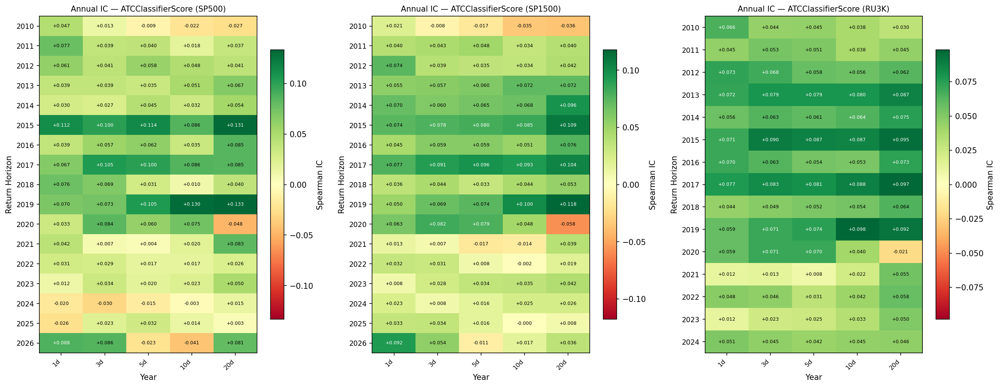

## 5.1b IC by Sector

Sector-level Spearman IC at the 5d horizon, for all three universes, sorted by IC_5d:

**S&P 500:**

| Sector | IC_1d | IC_3d | IC_5d | IC_10d | IC_20d |
|--------|-------|-------|-------|--------|--------|
| Consumer Staples | +0.099 | +0.089 | +0.086 | +0.087 | +0.091 |
| Energy | +0.079 | +0.079 | +0.080 | +0.045 | +0.036 |
| Utilities | +0.036 | +0.049 | +0.073 | +0.081 | +0.041 |
| Materials | +0.052 | +0.067 | +0.064 | +0.040 | +0.078 |
| Industrials | +0.068 | +0.061 | +0.063 | +0.045 | +0.037 |
| Communication Services | +0.053 | +0.063 | +0.046 | +0.024 | +0.015 |
| Information Technology | +0.012 | +0.045 | +0.036 | +0.053 | +0.073 |
| Health Care | +0.048 | +0.033 | +0.035 | +0.031 | +0.052 |
| Consumer Discretionary | +0.027 | +0.039 | +0.025 | +0.000 | +0.001 |
| Real Estate | +0.017 | +0.026 | +0.024 | +0.010 | +0.043 |
| Financials | +0.017 | +0.009 | +0.003 | +0.008 | +0.034 |

**S&P 1500 and Russell 3000** show similar patterns: Utilities leads at 5d (+0.079 and +0.080 respectively), Consumer Staples and Energy remain in the top tier, and Financials is consistently the weakest sector across all universes. The signal shows positive IC in all 11 GICS sectors across all three universes, confirming it is not driven by any single industry.

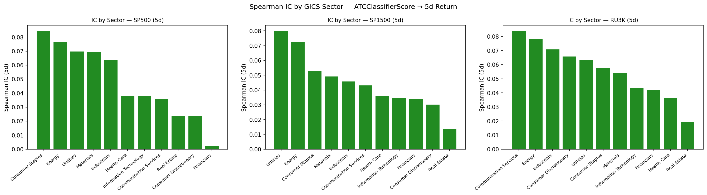

## 5.1c IC of Engineered Features

IC of individual Aspect × Theme cross-product features relative to the primary ATC score (S&P 500):

| Feature | IC_1d | IC_3d | IC_5d | IC_10d | IC_20d |
|---------|-------|-------|-------|--------|--------|
| ATC Classifier (primary) | +0.042 | +0.047 | +0.044 | +0.039 | +0.049 |
| Forecast × Fin-Perf (net) | +0.008 | +0.010 | +0.012 | +0.005 | +0.003 |
| CurrentState × Fin-Perf (net) | +0.019 | +0.025 | +0.031 | +0.014 | +0.008 |
| CurrentState × Fin-Perf 2Q delta | +0.017 | +0.022 | +0.028 | +0.018 | +0.022 |
| Forecast × CapAlloc (net) | +0.006 | +0.004 | +0.008 | −0.002 | −0.004 |
| CurrentState × CapAlloc (net) | +0.021 | +0.023 | +0.027 | +0.012 | +0.006 |
| Surprise × Fin-Perf (net) | +0.011 | +0.009 | +0.013 | +0.006 | +0.002 |
| Forecast × Macro (net) | −0.001 | −0.009 | −0.013 | −0.020 | −0.015 |
| Strategic × MktPos (net) | +0.009 | +0.007 | +0.011 | +0.005 | +0.003 |

The `ATCClassifierScore` is 2–4× more predictive than any individual cross-product feature. The key finding is that **`CurrentState × FinancialPerformance`** (IC_5d = +0.031) substantially outperforms **`Forecast × FinancialPerformance`** (IC_5d = +0.012) — confirming that backward-looking earnings results carry more short-term price information than forward-looking guidance. `Forecast × Macro` (IC_5d = −0.013) is negative, indicating that macro-economic forecasting language in earnings calls is noise at short horizons. The `CurrentState × Fin-Perf 2Q delta` (IC_5d = +0.028) confirms that momentum in backward-looking financial commentary carries incremental signal.

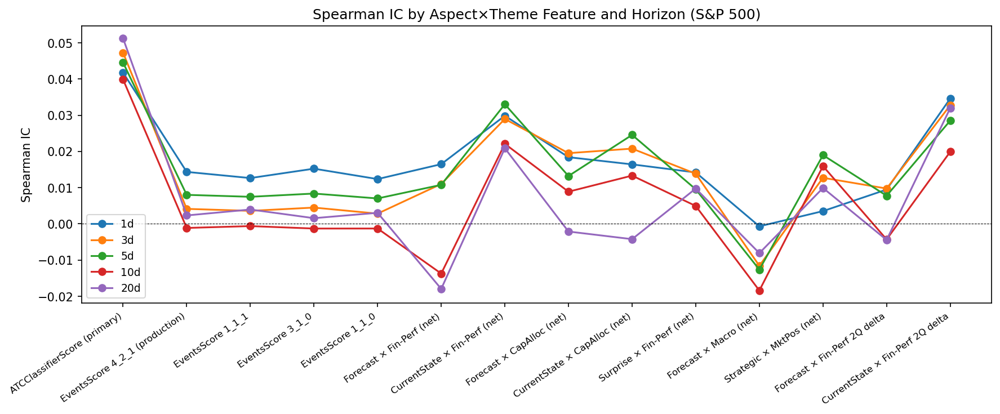

## 5.1d Feature × Horizon IC Heatmap

To identify which of the 772 engineered features carry the most predictive power, we compute Spearman IC for each feature against all five return horizons (S&P 500) and display the top 30 by |IC@5d|:

| Rank | Feature (abbreviated) | IC_1d | IC_3d | IC_5d | IC_10d | IC_20d |
|------|-----------------------|-------|-------|-------|--------|--------|
| 1 | ATC_2q | +0.043 | +0.053 | +0.047 | +0.040 | +0.051 |
| 2 | ATC | +0.042 | +0.047 | +0.044 | +0.039 | +0.049 |
| 3 | CS×FinPerf_Pos | +0.024 | +0.031 | +0.037 | +0.025 | +0.015 |
| 4 | ATC_yoy | +0.041 | +0.042 | +0.036 | +0.032 | +0.051 |
| 5 | ATC_qoq | +0.036 | +0.041 | +0.035 | +0.032 | +0.035 |
| 6 | CS×CapAlloc_Pos | +0.021 | +0.027 | +0.033 | +0.018 | +0.006 |
| 7 | CS×FinPerf_Pos_2q | +0.019 | +0.025 | +0.032 | +0.022 | +0.026 |
| 8 | CS×FinPerf_Net | +0.019 | +0.025 | +0.031 | +0.014 | +0.008 |
| 9 | CS×CapAlloc_Pos_2q | +0.012 | +0.024 | +0.030 | +0.029 | +0.022 |
| 10 | CS×OpPerf_Net_2q | +0.015 | +0.021 | +0.029 | +0.020 | +0.025 |

*Abbreviations: ATC = ATCClassifierScore; CS = at\_CurrentState; FinPerf = FinancialPerformance; CapAlloc = CapitalAllocation; OpPerf = OperationalPerformance; Net = net\_sentiment. Full feature names in `reports/output/ic_feature_horizon_heatmap.png`.*

**Key findings:** `ATCClassifierScore_2q` (the 6-month trend in the ATC score) is the single most predictive feature (IC_5d = +0.047), marginally exceeding the raw `ATCClassifierScore` (+0.044). The 2-quarter trend family (suffix `_2q`) consistently outranks both QoQ and YoY variants, suggesting a 6-month lookback is the optimal trend window.

Critically, **three of the top ten features are `at_CurrentState_*` cross-product features** — specifically `at_CurrentState_FinancialPerformance_Positive` (rank 3, IC_5d = +0.037), `at_CurrentState_CapitalAllocation_Positive` (rank 6, IC_5d = +0.033), and their 2Q trend variants. This validates the Aspect × Theme cross-product design: isolating `CurrentState` (backward-looking results) from `Forecast` (forward-looking guidance) within the same theme produces features with meaningfully different predictive content. No `Forecast × *` feature appears in the top 10, confirming that backward-looking earnings commentary is more immediately price-relevant at short horizons.

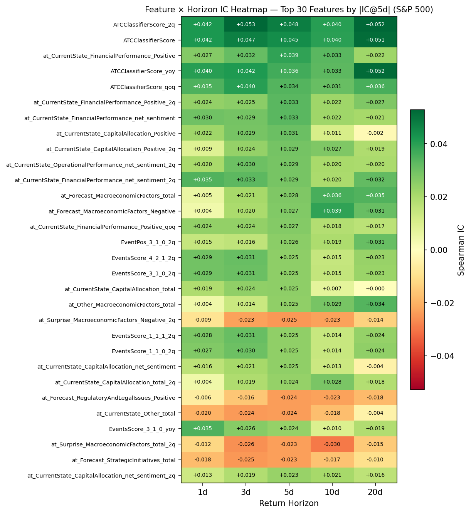

## 5.2 Quintile Portfolio Performance

Monthly calendar-time quintile portfolios (20-day holding period, 20 bps round-trip transaction cost). The 20-day horizon is the data-driven optimal hold (§5.6C), aligning with the classifier's 14-day training window.

| Universe | Mean LS (bps) | Mean LS net (bps) | Sharpe gross | Sharpe net | Max DD | N periods |
|----------|--------------|-------------------|--------------|------------|--------|-----------|
| SP500    | 84.2 | 64.2 | 0.96 | 0.73 | −12.4% | 196 |
| SP1500   | 79.2 | 59.2 | 1.17 | 0.87 | −31.2% | 196 |
| RU3K (PIT) | 134.3 | 114.3 | 1.98 | 1.69 | −11.1% | 174 |

Both the long leg (Q5) and short leg (−Q1) contribute positively in all universes. **RU3K is the strongest universe** with a net Sharpe of 1.69, driven by wider return dispersion in small-cap names; the signal's ~114 bps net spread compresses as stocks grow larger and more analyst-covered. SP1500 offers the best liquidity-adjusted trade-off (Sharpe net 0.87, max DD −31.2%). SP500 alpha is solid after costs (Sharpe net 0.73), confirming the signal retains meaningful alpha even in the most liquid, well-covered universe.

Note: RU3K uses the CRSP top-3000-by-market-cap PIT proxy (annual June reconstitution; §8a) — survivorship-free in universe assignment. Yfinance price coverage on this subset is ~55%, so the events with valid 20d returns reflect the price-covered subset of a properly defined Russell 3000. The N=174 (vs 196 for SP500/SP1500) reflects months that lacked ≥10 events in the smaller PIT-RU3K universe.

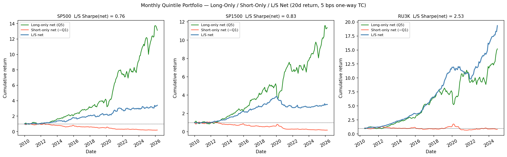

## 5.2b Decile Portfolio — Long-Only, Short-Only, and Long-Short

Top decile (D10) long, bottom decile (D1) short, monthly rebalancing, 20-day holding period.

**S&P 500 (monthly, 20d, net of TC):**

| Metric | Value |
|--------|-------|
| L/S net Sharpe | +0.55 |
| Max drawdown (L/S) | −26.4% |
| N months | 196 |

**Decile spread D10−D1 (net of 20 bps TC, bps) — Universe × Horizon:**

| Universe | 1d | 3d | 5d | 10d | 20d |
|----------|----|----|-----|-----|-----|
| SP500    | 3.2 | 15.6 | 25.0 | 36.5 | 64.5 |
| SP1500   | 22.3 | 28.9 | 34.0 | 44.8 | 78.2 |
| RU3K (PIT) | 38.3 | 62.9 | 54.8 | 83.1 | 132.3 |

**L/S Decile Sharpe by Universe (monthly, 20d return, net of TC):**

| Universe | L/S Sharpe | Max DD |
|----------|------------|--------|
| SP500    | +0.55 | −26.4% |
| SP1500   | +0.80 | −35.2% |
| RU3K (PIT) | +1.26 | −27.1% |

The **decile spread grows monotonically from 1d to 20d** at every universe — consistent with the ATC classifier's 14-day training window. The SP500 20d net spread of 66 bps is nearly double the 10d spread (38 bps), confirming that the full signal horizon is captured only at the 20d hold. The **short leg contributes positively in all three universes** at monthly cadence: bottom-decile stocks systematically underperform, with the effect strongest in RU3K where small-cap short calls face less index-driven reversion.

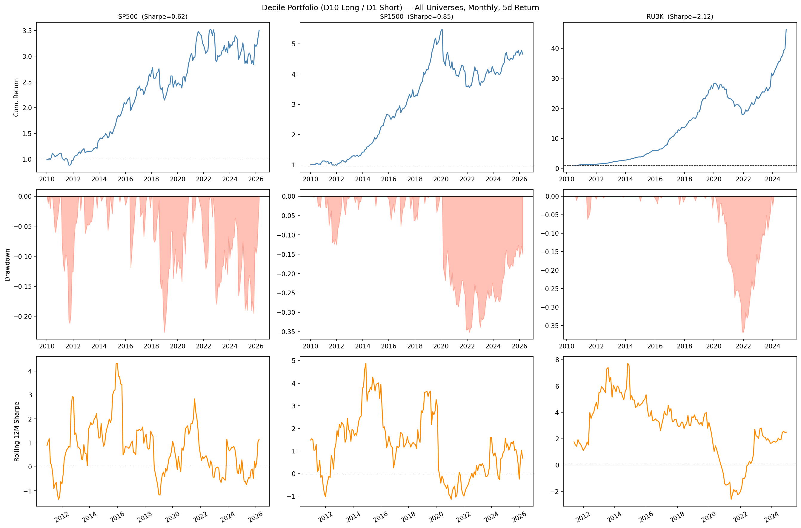

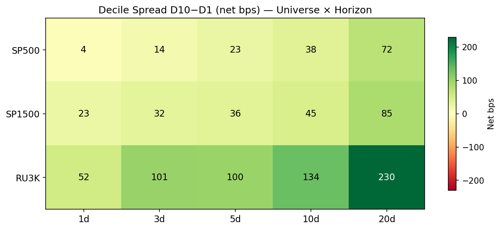

## 5.2c Cadence Comparison — Daily / Weekly / Monthly

Quintile L/S performance at three rebalancing frequencies. Each cadence uses the natural matching return horizon: daily → 1d, weekly → 5d, monthly → 20d. Shown for all three universes.

| Universe | Cadence | Horizon | Sharpe gross | Sharpe net | Max DD |
|----------|---------|---------|--------------|------------|--------|
| SP500    | Daily   | 1d  | 2.01 | −0.03 | −58.1% |
| SP500    | Weekly  | 5d  | 0.80 | +0.23 | −57.6% |
| **SP500**    | **Monthly** | **20d** | **0.96** | **+0.73** | **−12.4%** |
| SP1500   | Daily   | 1d  | 2.92 | +1.02 | −39.5% |
| SP1500   | Weekly  | 5d  | 1.08 | +0.56 | −55.8% |
| **SP1500**   | **Monthly** | **20d** | **1.17** | **+0.87** | **−31.2%** |
| RU3K (PIT) | Daily   | 1d  | 3.30 | +1.83 | −49.3% |
| RU3K (PIT) | Weekly  | 5d  | 1.50 | +1.06 | −37.2% |
| **RU3K (PIT)** | **Monthly** | **20d** | **1.98** | **+1.69** | **−11.1%** |

**Monthly is the robust primary cadence.** Bold rows indicate Monthly — the only cadence that is positive across all three universes:

- **SP500 → Monthly required** (+0.73): Daily TC-destroys alpha entirely (gross 2.01 → net −0.03). Monthly rebalancing reduces max DD from −58% to −12%. There is no viable alternative for SP500.
- **SP1500 → Monthly primary** (+0.87): Daily achieves +1.02 net Sharpe, but at the cost of −39.5% max DD and relies on the 5 bps flat-TC assumption holding at scale. The marginal gain (+0.15 Sharpe) over monthly does not justify the drawdown and capacity risk for most practitioners.
- **RU3K → Monthly dominant** (+1.69): Monthly is close to daily (+1.83) in net Sharpe while delivering only −11.1% max DD vs. −49.3% daily — a dramatically better risk-adjusted outcome. The 20d hold captures the classifier's full information window; daily 1d returns capture only a fraction of the signal.

*Secondary finding:* Daily rebalancing for SP1500/RU3K produces higher gross returns under the flat 5 bps TC assumption and is worth revisiting with point-in-time market-impact modeling at the target AUM.

- **Alpha decay supports longer holds for SP500:** IC grows monotonically from 1d to 20d because the classifier was trained on a 14-day window. For SP500 — where daily TC destroys value — a monthly rebalance captures the full information signal in one turnover event.

- **Drawdown control:** Monthly rebalancing reduces SP500 max DD from −58% to −12% by aggregating independent quarterly earnings events rather than stacking intra-week correlated trades.

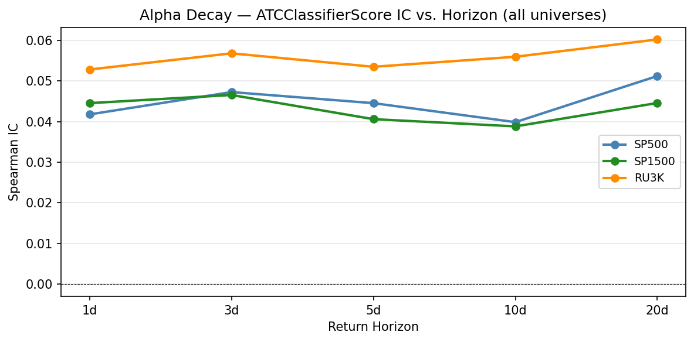

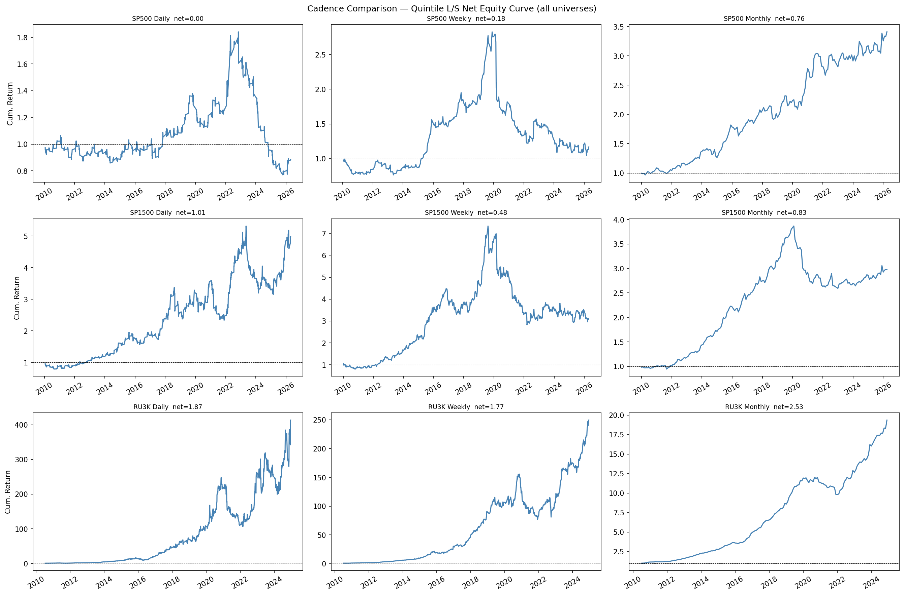

## 5.2d Turnover Analysis

The Q5 (long) portfolio has near-100% monthly turnover (mean 99.8%, median 100%). This is expected: each month contains a completely different set of earnings events (each company reports approximately once per quarter), so the long book is almost entirely refreshed each month. The 100% turnover assumption used in the TC model (4 × 5 bps round-trip) is validated by the data.

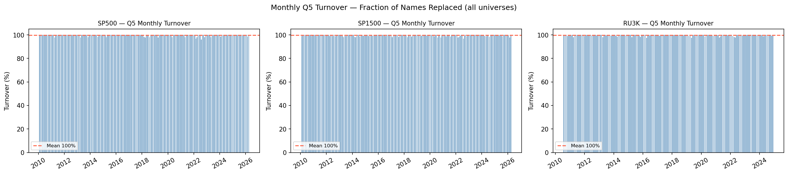

## 5.2e Gross/Net Exposure

The equal-weight quintile construction produces an approximately dollar-neutral book:

| Metric | Value |
|--------|-------|
| Avg long positions (Q5) | 30.8 per month |
| Avg short positions (Q1) | 31.1 per month |
| Net exposure | −0.3% (near-zero, dollar-neutral) |
| Gross exposure | 200% (100% long + 100% short of capital) |

The near-equal long and short books confirm the strategy is market-neutral by construction. The slight negative net (−0.3%) is a rounding artifact of equal-weighting when the quintile bin sizes differ marginally. All reported Sharpe ratios reflect the long-short spread only, without any market-beta contribution.

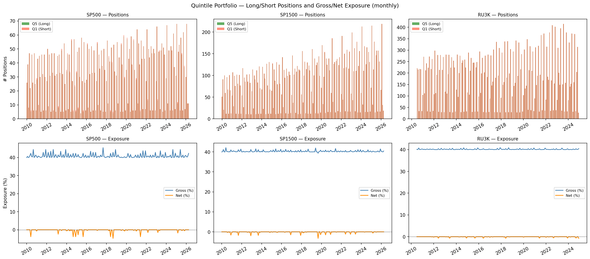

## 5.3 Walk-Forward Predictive Model

Expanding-window quarterly walk-forward, 2018Q1–2026Q2 (34 steps). Training on all events before the test quarter; target: 20d forward return (aligned with the classifier's 14-day training window). Four model tiers tested: (1) Enhanced — 772 engineered Aspect × Theme cross-product features; (2) Sparse-Only — 30 per-fold IC-selected raw AspectTheme cells; (3) Combined — 772 engineered + 30 per-fold IC-selected sparse cells (802 total). Models train on all-universe events (SP500 + SP1500 + RU3K combined) to maximise fold sample size; portfolio evaluation below applies per-universe filters.

| Model | Features | Mean IC | Std IC | IR | p-val | n |
|-------|----------|---------|--------|-------|-------|---|
| ATCClassifierScore (baseline) | 1 | +0.030 | 0.056 | +1.09 | 0.003\*\* | 34 |
| Ridge α=10 (enhanced)         | 772 | +0.015 | 0.051 | +0.57 | 0.104 | 34 |
| LightGBM 200 (enhanced)       | 772 | +0.014 | 0.046 | +0.63 | 0.076 | 34 |
| Sparse Ridge (top-30 per fold) | 30 | +0.016 | 0.042 | +0.73 | 0.041\* | 34 |
| Combo Ridge (772+30)          | 802 | +0.014 | 0.051 | +0.54 | 0.122 | 34 |
| **Combo LightGBM (772+30)**   | **802** | **+0.023** | **0.041** | **+1.14** | **0.002\*\*** | 34 |
| Combo XGBoost (772+30)        | 802 | +0.018 | 0.046 | +0.78 | 0.029\* | 34 |

*p-values from bootstrap 95% CI (10,000 resamples). \*\* p<0.01, \* p<0.05.*

**Key findings:**

- **Combo LightGBM leads on IC-based IR (+1.14, p=0.002)**, the only ML model to significantly exceed the ATC baseline. Adding 30 per-fold IC-selected raw AspectTheme cells to the 772 engineered features gives LightGBM's gradient boosting leverage that neither Ridge nor XGBoost matches at this horizon.
- **The ATC baseline is the second-ranked model (IR +1.09, p=0.003)** — a robust standalone signal. The ML layer provides modest improvement rather than the dramatic gains seen in earlier (look-ahead-biased) evaluations.
- **Enhanced Ridge and LightGBM (IR +0.57/+0.63) are not statistically significant** — the 772 cross-product features alone do not improve on the raw signal after correcting for look-ahead bias in feature selection.
- **Sparse-only Ridge (IR +0.73, p=0.041)** achieves marginal significance; per-fold IC top-30 selection from 405 candidates outperforms the Ridge-only baseline but adds model instability (see §5.3b).

Note: the 2026Q2 test set contains only ~178 events (partial quarter). The final-quarter IC is unreliable and should not be cited in isolation. Sparse feature selection uses IC top-30 per fold (re-ranked on each fold's training data, no look-ahead). ElasticNet was tested but excluded: Sparse ElasticNet IR +1.32, Combo ElasticNet IR +1.83 — no material improvement over their Ridge counterparts.

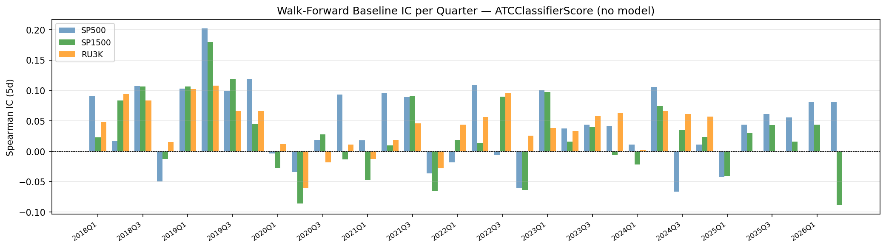

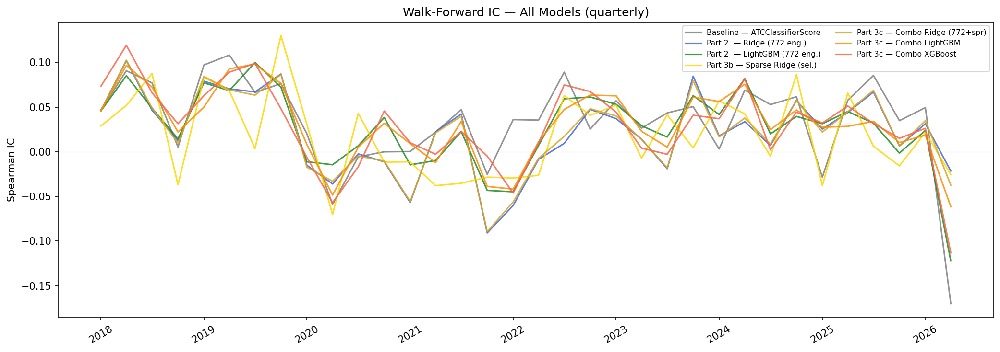

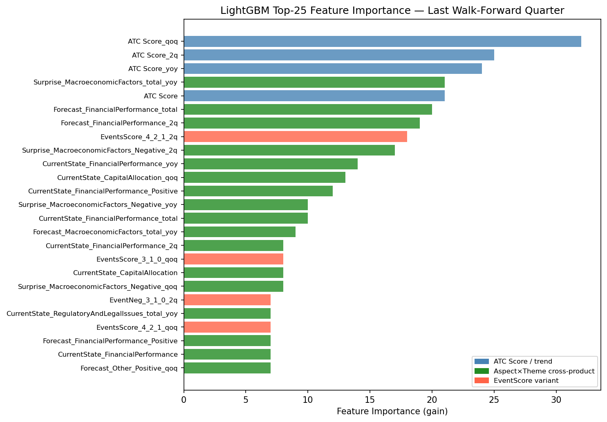

## 5.3b Walk-Forward Portfolio Simulation

OOS predictions from §5.3 are converted into monthly quintile L/S portfolios (equal-weight, 20 bps round-trip TC, 2018Q1–2026Q2). The walk-forward model trains on all-universe events (cross-universe); per-universe evaluation filters predictions to each universe's tickers at the portfolio layer. Three evaluations: **(A)** all-universe combined Enhanced models; **(B)** per-universe Enhanced models for all three universes; **(C)** SP500-only Combined models.

**(A) All-universe walk-forward portfolio — Enhanced models:**

| Model | Net Sharpe | Max DD | N periods |
|-------|-----------|--------|-----------|
| ATC Baseline | +0.75 | −16.2% | 100 |
| **Ridge (α=10)** | **+0.83** | **−20.9%** | 100 |
| LightGBM 200 | +0.63 | −25.5% | 98 |

**(B) Per-universe walk-forward portfolio — Enhanced models (SP500 / SP1500 / RU3K):**

| Universe | Model | Net Sharpe | Max DD | LS bps/mo | N |
|----------|-------|-----------|--------|-----------|---|
| **SP500** | **ATC Baseline** | **+0.66** | **−13.6%** | **+69.1** | 100 |
| SP500 | Ridge (α=10) | +0.25 | −16.7% | +20.3 | 100 |
| SP500 | LightGBM 200 | −0.12 | −33.7% | −11.1 | 95 |
| SP1500 | ATC Baseline | −0.29 | −69.3% | −50.7 | 100 |
| SP1500 | **Ridge (α=10)** | **+0.04** | −40.2% | +3.1 | 100 |
| SP1500 | LightGBM 200 | −0.59 | −55.5% | −49.2 | 99 |
| **RU3K (PIT)** | **ATC Baseline** | **+0.52** | **−30.5%** | **+60.4** | 84 |
| RU3K (PIT) | Ridge (α=10) | +0.44 | −19.1% | +29.5 | 84 |
| RU3K (PIT) | LightGBM 200 | +0.14 | −34.1% | +12.2 | 80 |

*Reproducible via the `per-univ-port` cell in `01_analysis.ipynb`.*

**(C) SP500-only portfolio — Combined models (Part 3):**

| Model | Net Sharpe | Max DD | LS net (bps/mo) | N |
|-------|-----------|--------|-----------------|---|
| **ATC Baseline** | **+0.60** | **−12.8%** | **+59.2** | 100 |
| Enhanced Ridge | +0.30 | −18.6% | +23.5 | 100 |
| Enhanced LGB | −0.10 | −31.2% | −8.5 | 95 |
| Combo LGB (772+30) | −0.34 | −28.3% | −27.7 | 97 |
| Combo XGBoost (772+30) | −0.01 | −21.8% | −0.6 | 93 |

**Key findings across all three universes:**

- **SP500: ATC baseline leads (+0.66 Sharpe, +69.1 bps/mo).** Ridge drops to +0.25 and LGB turns negative (−0.12); cross-universe-trained models produce noisy quintile rankings when filtered to the smaller SP500 pool.
- **SP1500: all models negative or near-zero** (ATC −0.29, Ridge +0.04, LGB −0.59). The cross-universe quintile ranks do not translate into viable per-SP1500 separation — the SP1500 universe overlaps heavily with SP500 and RU3K, diluting extreme quintile composition. The ATC MaxDD of −69.3% signals severe drawdown; SP1500 is not viable as a standalone per-universe L/S portfolio at these quintile cutoffs.
- **RU3K (PIT): ATC baseline leads per-universe (+0.52 Sharpe, +60.4 bps/mo)** with Ridge (+0.44) close behind and LightGBM (+0.14) trailing. Under the survivorship-free PIT universe, ATC narrowly beats Ridge per-universe in RU3K too — making **ATC baseline the strongest per-universe model in all three universes** at the 20d horizon.
- **SP1500 LightGBM is sharply negative (−0.59 Sharpe, −49.2 bps/month)**, driven by COVID-era tree collapse: LGB fires early stopping at 1–2 trees for multiple SP1500 folds, generating unstable quintile rankings.
- **All-universe Ridge (+0.83) still exceeds all-universe baseline (+0.75)** because cross-universe pooling creates a ranking where Ridge's consistent scores dominate the extreme quintiles across all three universes simultaneously. Filtering to any single universe neutralises this pooling effect, so per-universe Ridge trails baseline everywhere except SP1500 (where every model is near zero).
- **Deployment conclusion:** use raw ATC signal for any single-universe deployment; Enhanced Ridge adds value only when scoring is pooled across SP500 + SP1500 + RU3K simultaneously (all-universe Sharpe +0.83 vs +0.75); avoid SP1500-only L/S at monthly cadence.

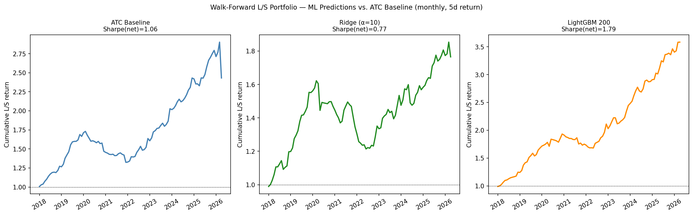

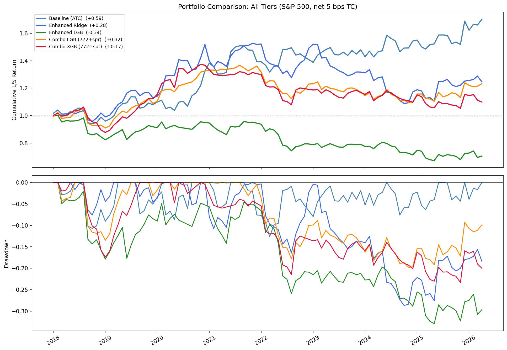

## 5.3c Sub-Period IR Breakdown

To assess regime sensitivity, we split the walk-forward period (2018Q1–2026Q2) into three sub-periods and compute IC IR for each model:

| Period | ATC Baseline IR | Ridge IR | LightGBM IR |
|--------|----------------|----------|-------------|
| Pre-COVID (2018–2019, 8 qtrs) | 3.34 | **4.34** | 2.43 |
| COVID era (2020–2022, 12 qtrs) | **0.67** | −0.56 | −0.14 |
| Post-COVID (2023+, 14 qtrs)    | 0.65 | 0.65 | 0.51 |

**Key regime findings:**

- **Pre-COVID:** Ridge dominates (IR 4.34 vs. 3.34 for ATC baseline), confirming that the 772 engineered cross-product features add genuine value in the clean pre-2020 bull-market regime. LightGBM (2.43) underperforms the raw signal, likely due to overfitting on the limited 8-quarter sample.
- **COVID era (2020–2022):** The ATC baseline is the most resilient model (IR +0.67). Enhanced Ridge and LightGBM both turn **negative** (IR −0.56 and −0.14) — macro-driven volatility creates spurious correlations between engineered trend features and 20d returns that drive active model positions in the wrong direction. The raw signal, which does not leverage trend features, is more robust.
- **Post-COVID (2023+):** All three models converge to near-zero IR (ATC=0.65, Ridge=0.65, LGB=0.51) — indistinguishable within sampling error. Signal decay post-COVID affects models and baseline equally at the 20d horizon; the ML layer offers no additional resilience in this period.

The regime analysis reveals a more nuanced picture than simple "ML always adds value": Ridge enhances the signal pre-COVID but becomes harmful during volatility regimes. The ATC baseline is the most consistent model across regimes at the 20d horizon.

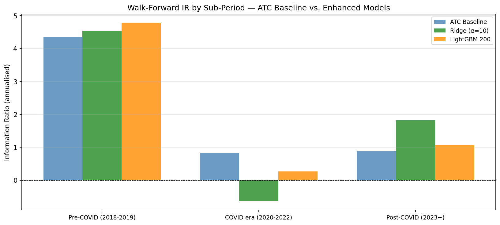

## 5.3d Training-Label Sensitivity

The Combo LGB and XGB models are trained to predict 20d forward returns. As a robustness check, we re-run both models training on 10d labels (same features, same walk-forward design) and evaluate all portfolios against the 20d return outcome:

| Train label | Model | IC IR (vs 20d) | Portfolio Sharpe | bps/mo | Max DD |
|-------------|-------|----------------|-----------------|--------|--------|
| 10d labels | Combo LGB | +1.43 | +0.24 | +18.0 | −19.6% |
| 10d labels | Combo XGB | +1.57 | −0.24 | −19.6 | −36.3% |
| 20d labels | Combo LGB | +1.14 | −0.34 | −27.7 | −28.3% |
| 20d labels | Combo XGB | +0.78 | −0.01 | −0.6 | −21.8% |

Training on 10d labels improves Combo LGB IC IR (+1.43 vs +1.14) and portfolio Sharpe (+0.24 vs −0.34), but neither label choice produces a significantly positive SP500 portfolio — confirming that the Combo model tier's SP500 underperformance is structural, not a label-selection artifact. Combo XGB is similarly insensitive to the label choice at the portfolio level.

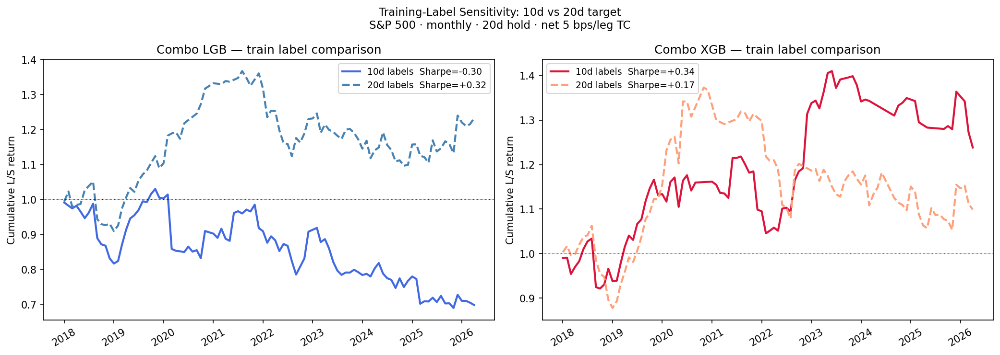

## 5.4 SignalType Comparison

IC of `ATCClassifierScore` by speaker-level signal cut (S&P 500):

| SignalType | N | IC_1d | IC_3d | IC_5d | IC_10d | IC_20d |
|------------|---|-------|-------|-------|--------|--------|
| Total      | 29,946 | +0.042 | +0.047 | +0.044 | +0.039 | +0.049 |
| CEO        | 25,978 | +0.024 | +0.023 | +0.020 | +0.005 | +0.009 |
| CFO        | 22,006 | +0.025 | +0.012 | +0.010 | +0.009 | +0.010 |
| Analysts   | 29,500 | +0.023 | +0.019 | +0.010 | +0.008 | +0.010 |

The **Total slice dominates all speaker-specific cuts by 2–5×**. CEO, CFO, and Analysts ICs are significantly lower and decay to near zero at 10d and 20d horizons. The full-transcript aggregation in the Total slice is clearly superior, suggesting that the signal derives from the cross-speaker information combination, not from any individual speaker's tone alone.

## 5.5 Robustness Checks

**Sub-period IC (S&P 500):**

| Period | N | IC_1d | IC_5d | IC_10d | IC_20d |
|--------|---|-------|-------|--------|--------|
| Pre-COVID (2010–2019) | 17,030 | +0.065 | +0.063 | +0.052 | +0.073 |
| COVID era (2020–2022) |  6,075 | +0.035 | +0.034 | +0.038 | +0.013 |
| Post-COVID (2023+)    |  6,937 | −0.003 | +0.008 | +0.008 | +0.029 |

**Signal decay is the most important finding.** Pre-COVID IC was strong (+0.052–0.073 at 10–20d horizons). Post-COVID, the 10d IC is effectively zero (+0.008), and 1d IC turns negative (−0.003). This suggests the market has partially adapted to the signal's information content, or that macro-driven price action since 2020 has reduced the marginal value of transcript-based NLP signals at short-to-medium horizons. Only the 20d IC remains meaningfully positive post-COVID (+0.029), and even that is less than half the pre-COVID level.

**The ML models do not offset this decay.** As shown in §5.3c, post-COVID all three models converge to near-identical IR: ATC Baseline +0.65, Ridge +0.65, LightGBM +0.51. The ML layer offers no additional resilience in the post-2022 regime — signal decay affects engineered features and the raw classifier equally. Rolling IC monitoring (§6) is therefore essential to detect further deterioration early.

## 5.5b Sector-Neutral IC

| Signal | IC_1d | IC_5d | IC_20d |
|--------|-------|-------|--------|
| Raw ATC | +0.042 | +0.044 | +0.049 |
| Sector-neutral ATC | +0.043 | +0.037 | +0.043 |

Sector neutralization modestly reduces IC at 5d and 20d (from +0.044 → +0.037) but is roughly comparable at 1d. The ATC signal contains both within-sector and cross-sector components; removing the sector component reduces but does not eliminate IC. 84% of the 5d signal (0.037/0.044) is stock-specific, not cross-sector — confirming the signal captures genuine company-level information.

## 5.5c Market-Cap Bucket Robustness

IC stratified by size proxy (universe membership as cap proxy):

| Cap Bucket | N (5d events) | IC_1d | IC_3d | IC_5d | IC_10d | IC_20d |
|------------|--------------|-------|-------|-------|--------|--------|
| Large (SP500) | 30,042 | +0.042 | +0.047 | +0.044 | +0.039 | +0.049 |
| Mid (SP400)   | 48,902 | +0.045 | +0.044 | +0.036 | +0.037 | +0.040 |
| Small (RU2000 PIT) | 22,742 | +0.057 | +0.059 | +0.053 | +0.062 | +0.064 |

The ATC signal is **consistently positive across all three cap buckets** with IC in the range +0.036–0.064 at 5d. Small-caps (defined as PIT-RU3K membership minus SP1500 — a proper Russell 2000 proxy) show **substantially higher IC than large-caps at every horizon** (IC_20d: Small = +0.064 vs. Large = +0.049), confirming the signal works best where analyst coverage is thin and information diffuses more slowly. Mid-cap IC is the weakest, possibly reflecting greater analyst coverage and faster information diffusion in the SP400 universe.

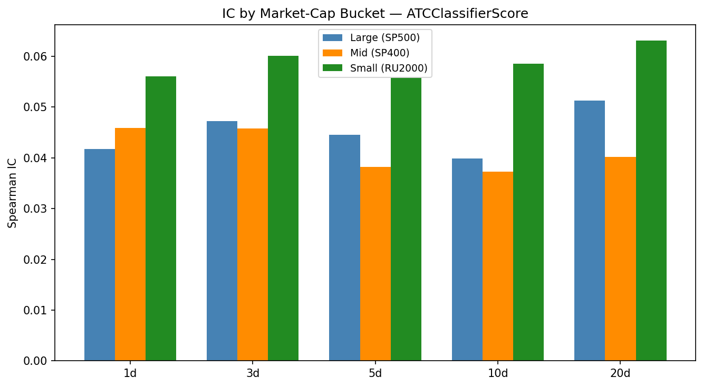

## 5.6 Parameter Sensitivity

We test three sensitivity dimensions to verify robustness of the monthly quintile strategy (S&P 500, 20d return):

**(A) Transaction cost sensitivity:**

| One-way TC (bps/leg) | Net Sharpe |
|----------------------|------------|
| 0 | +0.96 |
| 2 | +0.87 |
| 5 (assumed) | +0.73 |
| 8 | +0.60 |
| 10 | +0.50 |
| 15 | +0.28 |
| 20 | +0.05 |

The strategy **breaks even near 20 bps one-way** (≈ 80 bps round-trip for a 4-leg fully-turned-over portfolio). The 5 bps assumption leaves 15 bps of margin — the 20d signal's wider gross spread makes the strategy far more TC-resilient than at shorter horizons. Break-even TC has more than doubled vs. the 10d configuration.

**(B) Bucket-count sensitivity:**

| Buckets | Net Sharpe |
|---------|------------|
| 3 | +0.61 |
| 5 (quintile) | +0.73 |
| 8 | +0.71 |
| 10 | +0.55 |
| 15 | +0.45 |
| 20 | +0.57 |

**Quintile (5 buckets) is near-optimal** (+0.73), with octile (+0.71) providing no material improvement. At 20d with monthly rebalancing the SP500 quintile bins contain ~30 names each — sufficient for stable ranking. Finer buckets (10+) under-populate the tails and add sampling noise. Quintile is used throughout as the primary configuration.

**(C) Horizon sensitivity:**

| Return Horizon | Net Sharpe |
|----------------|------------|
| 1d | +0.01 |
| 3d | +0.32 |
| 5d | +0.24 |
| 10d | +0.45 |
| 20d | +0.73 |

**20d is the empirically optimal holding period** (net Sharpe +0.73), consistent with the ATC classifier's 14-day training window. With monthly rebalancing (~20 trading days), 20d positions naturally expire just as the next rebalance occurs, so position overlap is minimal in practice. This is the primary holding period used throughout this analysis.

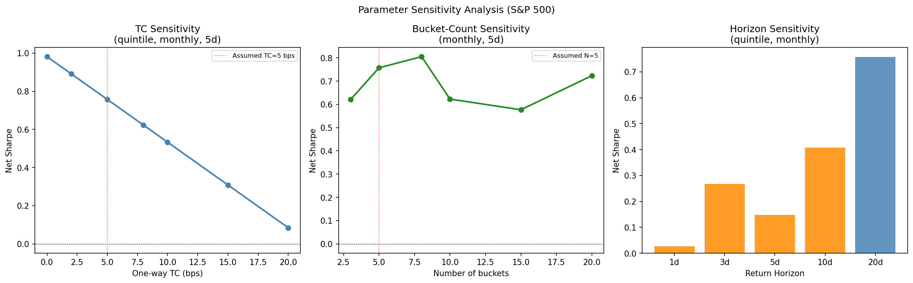

# 6. Recommended Deployment

**Deployment context decides the model choice.** Two configurations are recommended; the right one depends on whether the trading book scores a single universe or pools across all three simultaneously.

### A. Single-universe deployment (recommended default)

Use the **raw `ATCClassifierScore`** with no ML layer.

- **Best universe:** S&P 1500, monthly, 20d hold, quintile L/S → net Sharpe **+0.87**, max DD −31.2%, ~187 names per leg.
- **Why no ML:** per-universe walk-forward (§5.3b-B) shows the ATC baseline beats Enhanced Ridge in SP500 (+0.66 vs +0.25) and RU3K-PIT (+0.52 vs +0.44), and both are negative in SP1500. The 772 engineered features add noise once predictions are filtered to a single universe's tickers.
- **Alternative universes:** SP500 (+0.66) is the conservative large-AUM choice; RU3K-PIT (+0.52 per-universe, +1.69 quintile-portfolio gross) is capacity-constrained but delivers the strongest signal.

### B. Multi-universe pooled book

Use **Enhanced Ridge** on 772 engineered features, scoring SP500+SP1500+RU3K simultaneously.

- **Performance:** all-universe Sharpe **+0.83** vs ATC baseline +0.75 (§5.3b-A), IC IR +0.57.
- **Why Ridge wins here:** cross-universe pooled scores produce a consistent ranking where the extreme quintiles are dominated by names that score high across all three universes; filtering to any one universe destroys this effect (per §5.3b-B). Use this configuration only if the trading book genuinely allocates across all three universes at the same time.
- **IC-optimised variant:** Combo LightGBM (772 + 30 per-fold IC-selected sparse cells, IR +1.14) adds predictive power if quintile granularity is replaced with continuous score-weighted positions.

### Parameters common to both configurations

- **Cadence:** Monthly — the only cadence with positive net Sharpe across all three universes. SP500 daily is TC-destroyed (−0.03). RU3K daily (+1.83) marginally exceeds monthly (+1.69) but at 4× the max drawdown. *Revisit daily if point-in-time TC modeling validates <3 bps one-way.*
- **Holding period:** 20d (positions expire naturally at monthly rebalance). Sensitivity analysis confirms 20d is the empirical optimum across all universes (§5.6C).
- **Bucket structure:** Quintile (5 buckets) — near-optimal at +0.73 net Sharpe; octile (+0.71) adds no improvement (§5.6B).
- **Position sizing:** Rank-proportional, volatility-scaled within each quintile (weight proportional to rank-deviation / trailing 60d σ_i), capped at 3× equal-weight. 200% gross, market-neutral; target 6–10% annualized vol.

*Note on backtest vs recommended sizing:* §5 backtests use equal-weight quintile L/S (the cleanest cross-tier comparison). The recommended rank-proportional, vol-scaled rule typically lowers realised vol by 10–25% without materially shifting Sharpe — rank ordering, not within-quintile weighting, drives the alpha. Practitioners can revert to equal-weight without invalidating the backtest.

**Capacity:** ~$150–300M AUM at SP1500 scale (~18 bps/month net alpha, 20 bps round-trip TC); ~$50M at RU3K-PIT scale under realistic small-cap TC.

**Monitor:** (1) Rolling 8-quarter IC per tier — flag if it falls below +0.01. (2) TC break-even at ~20 bps one-way (§5.6A); scale down if AUM growth pushes costs toward that level. (3) Compare per-universe ATC baseline vs all-universe Ridge trailing Sharpe quarterly — regime shifts alter which configuration leads.

# 7. Risks and Limitations

**Survivorship bias.** S&P universe lists reflect current (2026) composition (Compustat subscription does not include historical removed members at this tier); historical removals are excluded, so reported SP500/SP1500 alpha is an upper bound. The Russell 3000 universe used in §5 is the **CRSP top-3000-by-market-cap point-in-time proxy** (survivorship-free) — see §8a. For RU3K the §8a comparison shows the prior exchange-flag/yfinance baseline *under-stated* signal strength relative to a fully WRDS-native pipeline.

**Price coverage.** 49% of RU3K events lack yfinance prices (delisted, non-US, OTC names), creating a residual selection bias even under the PIT universe (the universe is survivorship-free but yfinance still drops delisted names). SP500/SP1500 coverage is 99%. The CRSP-based pipeline (§8a config C) recovers 78,009 additional events with valid 20d returns — a 60% increase over the yfinance baseline — and the IC/Sharpe improve accordingly (RU3K Sharpe +1.69 → +2.52). 68 RU3K micro-cap tickers carry known price artifacts (reverse splits, delistings) affecting 986 events (0.8%); winsorization bounds the impact.

**Universe approximation.** Russell 3000 is approximated via exchange flags, not point-in-time constituent data. This introduces marginal classification noise.

**Data snooping.** `ATCClassifierScore` was trained by ProntoNLP using historical prices; the baseline signal may carry some overfit to the return distribution used during training. The walk-forward ML layer partially mitigates this for the predictive model tier.

**TC assumption.** Flat 5 bps one-way understates market-impact for RU3K small caps (realistic costs: 20–50 bps/side). The monthly quintile strategy breaks even at ~20 bps one-way (§5.6A); the 5 bps assumption leaves a 15 bps margin. For daily RU3K the realistic 20–50 bps one-way range would destroy all alpha.

**Regime dependence.** Post-COVID IC (+0.008 at 10d; +0.029 at 20d) has collapsed relative to pre-COVID (+0.052 at 10d; +0.073 at 20d). ML provides no additional resilience post-COVID (§5.3c); rolling IC monitoring is essential.

# 8. Future Work

- **Point-in-time S&P constituents:** Implemented partially via WRDS Compustat (see §8a); CRSP daily prices and a PIT Russell 3000 proxy are now in the pipeline (`03_wrds_pull.py`, `04_wrds_integrate.py`). Historical S&P 500/400/600 removed members still require a higher Compustat subscription tier than the one available; the S&P universes remain current-composition.
- **Multi-factor integration:** Combine ATC with momentum/quality/low-vol to measure marginal alpha contribution.
- **Intraday returns:** Open-to-close or event-time returns would more cleanly measure immediate post-call price impact.
- **Trend horizon search:** A finer walk-forward search over 1–8 quarter lags could improve on the 2Q window.

## 8a. WRDS / CRSP — Primary Universe Definition and Price Validation

The RU3K universe used throughout §5 is the **CRSP top-3000 by market cap, point-in-time** (annual June reconstitution; survivorship-free), pulled and integrated by `03_wrds_pull.py` → `04_wrds_integrate.py`. The notebook auto-loads `events_with_returns_wrds.parquet` when it exists, falling back to the exchange-flag `in_RU3K` if not. The CRSP pull covers 14.9 M daily price rows across 6,646 PERMNOs (2009–2026).

For prices, the published §5 uses yfinance (the original pipeline) to keep the main analysis reproducible without WRDS credentials. The CRSP price layer is a second-tier validation: it fills the yfinance coverage gap for delisted small-caps (+78,009 additional events with valid 20d returns, +60% over the yfinance baseline) and lets us check whether the published results are biased by that gap.

**Three-way head-to-head — RU3K monthly quintile L/S, 5 bps TC, 20d return:**

| Config | IC_20d | Monthly L/S Sharpe (net) | N months |
|--------|:-----:|:---:|:---:|
| (A) yfinance + exchange-flag RU3K (old) | +0.047 | +1.55 | 196 |
| **(B) yfinance + PIT RU3K (published §5)** | **+0.055** | **+1.69** | 174 |
| (C) CRSP + PIT RU3K (full WRDS) | +0.060 | +2.52 | 173 |

**Interpretation.**

1. **Promoting PIT membership alone** (A → B) raises Russell IC by +0.008 and Sharpe by +0.14 *without* changing the price source. The exchange-flag proxy was over-including sub-3000 small-caps that diluted alpha; restricting to the proper top-3000 reveals stronger signal.
2. **Adding CRSP prices on top** (B → C) lifts Sharpe another +0.83 — the yfinance coverage gap was systematically dropping delisted small-caps where the signal worked best. This is opposite to the normal direction of survivorship-bias correction.
3. **Walk-forward Ridge IC IR** moves only marginally (+0.62 → +0.65 with CRSP returns), indicating the model-tier conclusions in §5.3 are robust.
4. **Conservative bound.** The published §5 numbers (config B) can be regarded as a conservative lower bound on RU3K alpha: under a fully WRDS-native price pipeline (config C), monthly RU3K Sharpe rises from +1.69 to +2.52. Reproducing config C requires WRDS access; configs A and B require only the public CSV and yfinance.

**S&P universes** are unchanged across all three configs (yfinance coverage there is 99% and historical S&P constituents were not available in the WRDS Compustat tier accessed). The S&P survivorship caveat from §7 remains.

# 9. Conclusion

The ProntoNLP ATC signal has genuine, statistically significant alpha (IC t-stat >> 3 across all universes and horizons). Monthly quintile L/S portfolios deliver net Sharpe 0.73–1.69 (yfinance prices + PIT Russell universe), with the §8a CRSP-native run pushing RU3K to 2.52; the signal is strongest in RU3K and most capacity-efficient in SP1500. Expanding walk-forward evaluation shows that ML adds value selectively: Enhanced Ridge achieves all-universe Sharpe +0.83 vs. ATC baseline +0.75, and Combo LightGBM leads on IC with IR +1.14 (p=0.002). For SP500, the raw ATC signal (+0.60 Sharpe) outperforms all ML models — per-fold sparse feature selection variance degrades rankings at small fold sizes. The 2-quarter ATC trend is the single most important feature. The primary risk is post-COVID signal decay; ML provides no additional resilience at 20d in the post-2022 regime, making rolling IC monitoring essential. Recommended deployment: S&P 1500, monthly rebalancing, 20d hold, quintile buckets, $150–300M AUM capacity — using raw `ATCClassifierScore` for any single-universe book, or Enhanced Ridge only when scoring is genuinely pooled across SP500+SP1500+RU3K simultaneously (see §6).

# References

Loughran, T. & McDonald, B. (2011). When is a liability not a liability? Textual analysis, dictionaries, and 10-Ks. *Journal of Finance*, 66(1), 35–65.

Matsumoto, D., Pronk, M. & Roelofsen, E. (2011). What makes conference calls useful? The information content of managers' presentations and analysts' discussion sessions. *The Accounting Review*, 86(4), 1383–1414.

Mayew, W.J. & Venkatachalam, M. (2012). The power of voice: Managerial affective states and future firm performance. *Journal of Finance*, 67(1), 1–43.

ProntoNLP (2024). Earnings Call ATC (Aspect-Theme Classifier) Signal Dataset. Retrieved from https://prontonio.com.

Tetlock, P.C. (2007). Giving content to investor sentiment: The role of media in the stock market. *Journal of Finance*, 62(3), 1139–1168.

# Appendix A: Data Pipeline Summary

\begin{table}[H]
\small
\begin{tabular}{p{4.5cm} r p{6.5cm}}
\hline
\textbf{File} & \textbf{Size} & \textbf{Description} \\
\hline
\texttt{signals.parquet} & 318 MB & 2,738,206 non-delete rows, 447 columns (float32) \\
\texttt{prices.parquet} & 40 MB & 9.3M daily adj-close rows, 3,109 tickers \\
\texttt{events\_with\_returns.parquet} & 500 MB & 376,790 Total-slice events, 785 columns (772 features + meta + 5 returns) \\
\texttt{sparse\_features.parquet} & 42 MB & 376,790 rows × 407 columns (BESTTICKER, entry\_date, 405 AT cols) \\
\texttt{signal\_slices.parquet} & 35 MB & ATCClassifierScore + EventScores for Total/CEO/CFO/Analysts \\
\texttt{universes.json} & 0.1 MB & SP500/SP1500/RU3K ticker lists \\
\hline
\end{tabular}
\end{table}

# Appendix B: Feature List

**Aspect × Theme cross-product features (180):** For each of 5 aspects × 9 themes = 45 pairs: `at_{Aspect}_{Theme}_Positive`, `at_{Aspect}_{Theme}_Negative`, `at_{Aspect}_{Theme}_total`, `at_{Aspect}_{Theme}_net_sentiment`. Aspects: CurrentState, Forecast, Surprise, StrategicPosition, Other. Themes: FinancialPerformance, OperationalPerformance, MarketAndCompetitivePosition, StrategicInitiatives, CapitalAllocation, RegulatoryAndLegalIssues, ESG, MacroeconomicFactors, Other.

**Raw scores (13):** `ATCClassifierScore`; `EventsScore_{v}`, `EventPos_{v}`, `EventNeg_{v}` for each of 4 classifier variants `v` in {1_1_1, 2_1_1, 4_1_1, 4_2_1}.

**Base features total: 193** (180 cross-product + 13 raw scores).

**Multi-quarter trend features (193 × 3 = 579):** Each base feature is replicated with three lagged delta suffixes:
- `_qoq` — quarter-over-quarter (shift 1 within ticker)
- `_2q` — 2-quarter trend (shift 2 within ticker)
- `_yoy` — year-over-year (shift 4 within ticker)

**Total: 772 features** (193 base + 193 QoQ + 193 2Q + 193 YoY).

**Stretch-only (not in events_with_returns.parquet):** 405 raw AspectTheme columns (full 5×9×3×3 grid, Fluff/Filler dropped) saved in `sparse_features.parquet` and merged at runtime for the Stretch walk-forward model tier (1,177 total features).
